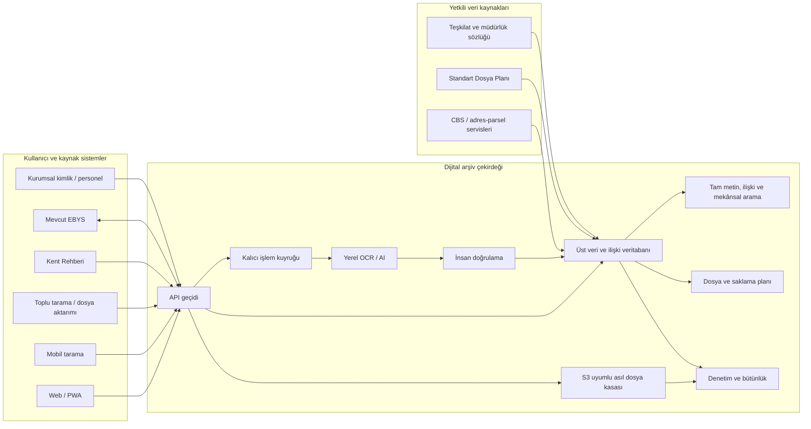
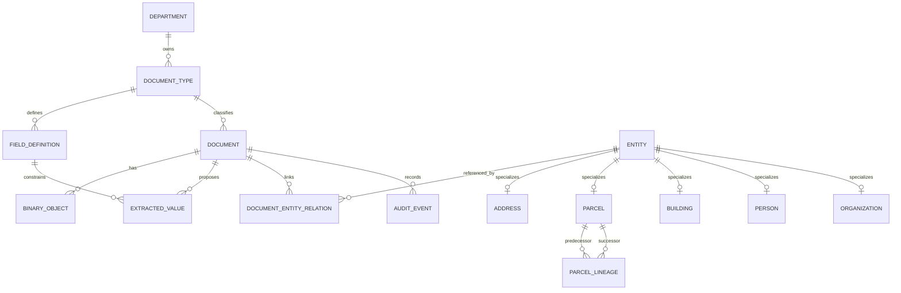

# Sivas Belediyesi Dijital Arşiv — Ana Sistem Tasarım Belgesi

**Belge durumu:** Kavramsal tasarım temeli — kurum görüşü ve onayı bekliyor  
**Sürüm:** 0.1  
**Tarih:** 29 Temmuz 2026  
**Belge sahibi:** Sivas Belediyesi; kurumsal sahipler belirlenecek  
**Teknik kapsam:** Dijital arşiv, akıllı belge işleme, varlık ilişkileri ve entegrasyonlar

> Bu belge bir uygunluk, sertifikasyon veya mevzuat görüşü değildir. Kurumsal kararlar; arşiv, hukuk/KVKK, bilgi işlem, CBS ve ilgili müdürlüklerin onayıyla kesinleşir.

## 1. Belgenin amacı

Bu belge, Sivas Belediyesi Dijital Arşiv Sisteminin ürün sınırını, işleyişini, veri modelini, teknik bileşenlerini, güvenlik ilkelerini ve diğer belediye sistemleriyle ilişkisini tek bir ana çerçevede tanımlar.

Belge şu sorulara ortak cevap verir:

- Sistem hangi problemi çözer?
- Tam bir EBYS’den hangi yönleriyle ayrılır?
- Müdürlüklere özgü belgeler nasıl yönetilir?
- Adres, parsel ve yapı üzerinden belgelere nasıl ulaşılır?
- Asıl dosyalar nasıl korunur?
- OCR ve yapay zekâ sonuçları nasıl doğrulanır?
- Kent Rehberi, EBYS ve kurumsal kimlik sistemiyle nasıl bütünleşilir?
- Pilot hangi ölçütlerle başarılı sayılır?

## 2. Ürün kararı ve kapsam sınırı

Sistem, ilk aşamada yeni bir EBYS olmayacaktır. Mevcut EBYS ve müdürlük uygulamalarıyla bütünleşebilen bir **dijital arşiv ve akıllı belge işleme katmanı** olacaktır.

### 2.1 Kapsam içi

- Fiziksel veya dijital belgenin güvenilir biçimde sisteme alınması
- Değiştirilemez asıl dosyanın korunması
- Yerel OCR, belge sınıflandırma ve alan çıkarımı
- Alan bazlı güven, kanıt koordinatı ve insan doğrulaması
- Müdürlük ve belge türüne göre yapılandırılabilir üst veri profilleri
- Adres, parsel, yapı ve diğer ortak varlıklarla belge ilişkilendirme
- Tam metin, üst veri, ilişki ve mekânsal arama
- Kent Rehberi/CBS üzerinden yetkiye bağlı belge çağırma
- Dosya planı, saklama, devir, ayıklama ve imha yaşam döngüsü
- Sunucu taraflı yetkilendirme ve değiştirilemez denetim izi
- S3 uyumlu nesne depolama ve uzun süreli koruma türevleri

### 2.2 İlk aşamada kapsam dışı

- Mevcut EBYS’nin yerine geçmek
- Kurum içi ve kurum dışı resmî yazışmaların tamamını yönetmek
- KEP, e-imza ve e-Yazışma süreçlerini yeniden geliştirmek
- İnsan onayı olmadan yapay zekâ sonucunu hukuki kayıt saymak
- Onaysız biçimde kişisel verileri kurum dışı yapay zekâ servislerine göndermek
- Bütün müdürlükleri tek seferde devreye almak

## 3. Temel tasarım ilkeleri

1. **Değiştirilemez asıl:** Yüklenen veya taranan asıl dosyanın üzerine yazılmaz.
2. **Ortak çekirdek, esnek profiller:** Ortak belge alanları merkezi; belge türüne özel alanlar yapılandırılabilir olur.
3. **Varlık odaklı arşiv:** Belge yalnızca klasörde değil; adres, parsel, yapı, kişi ve kurum ilişkileri üzerinden de bulunur.
4. **Yetkili kaynak:** CBS kimliği, dosya planı veya kurum birimi gibi veriler mümkün olduğunda yetkili sistemden alınır.
5. **Kanıtlı yapay zekâ:** Her çıkarılan alan değer, güven, sayfa, kanıt bölgesi, model ve doğrulama durumu taşır.
6. **İnsan denetimi:** Kritik veya düşük güvenli alanlarda nihai karar yetkili personeldedir.
7. **En az ayrıcalık:** Arama sonucu, dosya görüntüleme ve dışa aktarım ayrı ayrı yetkilendirilir.
8. **İzlenebilir yaşam döngüsü:** Belgenin kabulünden saklama sonuna kadar kritik olaylar denetim kaydına bağlanır.
9. **Taşınabilir depolama:** Uygulama üretimde tanımlı bir S3 uyumluluk profiline göre çalışır; tek sağlayıcıya kilitlenmez.
10. **Ölçerek yaygınlaştırma:** Önce dar pilot, sonra kanıtlanan profil ve süreçlerle müdürlüklere yayılım yapılır.

## 4. Sistem bağlamı

## 5. Kullanıcılar ve roller

| Rol | Temel sorumluluk | Varsayılan sınır |
|---|---|---|
| Görüntüleyici | Yetkili belgeleri arama ve görüntüleme | Müdürlük, belge sınıfı ve amaç |
| Doğrulayıcı | OCR alanlarını kanıtla karşılaştırma ve düzeltme | Atanmış görev/belge türü |
| Arşiv yöneticisi | Tasnif, dosya planı, saklama ve arşivleme | Kurumsal politika |
| Müdürlük veri sorumlusu | Belge profili ve iş kurallarını onaylama | İlgili müdürlük |
| CBS veri sorumlusu | Adres/parsel/yapı kimlikleri ve ilişkileri | Yetkili CBS kaynağı |
| Sistem yöneticisi | Kullanıcı, yapılandırma, işletim ve izleme | İş içeriğini gereksiz görmeden |
| Denetçi | Yetkili denetim kayıtlarını inceleme | Salt okunur, amaçla sınırlı |
| Entegrasyon istemcisi | Kent Rehberi/EBYS gibi sistem çağrıları | Servis ve son kullanıcı yetkisi |

Rol adları ve yetki kapsamları kurumun görev ayrılığı kararıyla kesinleşir.

## 6. Temel kullanıcı yolculukları

### 6.1 Belgeyi al, doğrula ve arşivle

1. Belge web, mobil, tarayıcı, toplu aktarım veya entegrasyonla gelir.
2. Dosya türü, zararlı içerik, boyut ve bütünlük kontrolleri uygulanır.
3. SHA-256 hesaplanır; asıl dosya benzersiz nesne anahtarıyla kasaya yazılır.
4. Sunucu depolanan nesneyi doğrular ve kabul alındısı üretir.
5. OCR kuyruğu sayfa işleme, sınıflandırma ve alan çıkarımı yapar.
6. Alanlar kurumsal sözlükler ve çapraz kurallarla değerlendirilir.
7. Kritik veya düşük güvenli sonuçlar insan doğrulamasına yönlendirilir.
8. Belge türü profili, dosya planı, erişim ve saklama kuralı tamamlanır.
9. Belge arşivlenir ve arama dizini güncellenir.

### 6.2 Varlık üzerinden belge bul

1. Kullanıcı Kent Rehberi’nde bir adres, parsel veya yapı seçer.
2. Kent Rehberi, görünen metin yerine yetkili CBS nesne kimliğini gönderir.
3. Arşiv API hem servis kimliğini hem son kullanıcı bağlamını doğrular.
4. Sistem doğrudan, dolaylı, tarihsel ve mekânsal ilişkileri ayrı türlerde sorgular.
5. Yetkisiz belgeler sonuçtan çıkarılır; gizli bilgi varlığı da sızdırılmaz.
6. Sonuçta ilişkinin türü ve kaynağı gösterilir.
7. Görüntüleme isteğinde kısa süreli erişim veya güvenli dosya akışı sağlanır.

### 6.3 OCR hatasını düzelt

1. Doğrulayıcı çıkarılan alanı belge üzerindeki kanıt bölgesiyle karşılaştırır.
2. Eski değer korunarak düzeltilmiş değer kaydedilir.
3. Düzeltme yapan kişi, zaman, gerekçe ve model sürümü denetim izine eklenir.
4. Gerekirse varlık bağlantısı CBS kaydıyla doğrulanır.
5. Onaylı sonuç arama dizinine ve ilgili entegrasyon görünümüne yansır.

## 7. Kavramsal veri modeli

### 7.1 Ortak çekirdek

Her belgede sistem kimliği, referans numarası, belge türü, sorumlu müdürlük, durum, oluşturma/kabul zamanı, dosya planı, erişim sınıfı, saklama kuralı ve denetim bağları bulunur.

### 7.2 Belge türü profilleri

Her belge türü profili şunları tanımlar:

- Görünen ad ve kurumsal sahibi
- Zorunlu ve isteğe bağlı alanlar
- Alan veri tipi, çokluk ve doğrulama kuralları
- Kritik alanlar ve insan onayı koşulları
- OCR/AI çıkarım politikası
- Kontrollü sözlük bağlantıları
- Dosya planı ve varsayılan saklama eşlemesi
- Arama ve dışa aktarım davranışı
- Profil sürümü ve geçerlilik tarihleri

### 7.3 Ortak varlıklar

İlk ortak varlık sınıfları adres, parsel, yapı, bağımsız bölüm, kişi, kurum ve organizasyon birimidir. Varlıkların görünen adından ayrı bir kurum içi kimliği; yetkili dış kaynak varsa ayrıca kaynak sistem ve dış kimliği bulunur.

### 7.4 Belge-varlık ilişkileri

Bir belge birden çok varlıkla; bir varlık birden çok belgeyle ilişkili olabilir. Her ilişki şu bağlamı taşır:

- İlişki türü: ana konu, ek, komşu, taraf, tarihsel bağlantı, mekânsal eşleşme vb.
- Kaynak: CBS doğrulaması, personel onayı, OCR önerisi, entegrasyon
- Güven ve doğrulama durumu
- Geçerlilik tarihleri
- Belge sayfası, kanıt metni ve koordinatı
- İlişkiyi kuran/onaylayan kişi veya sistem

### 7.5 Parsel ve adres kuralları

- Ada/parsel değerleri sayı değil metin olarak saklanır; `12-A`, `3/1` gibi ekler korunur.
- Parsel yalnız ada ve parsel değeriyle benzersiz kabul edilmez; ilçe, kadastro mahallesi ve mümkünse CBS parsel kimliği kullanılır.
- Bir belge birden fazla parselle ilişkilendirilebilir.
- İfraz, tevhit ve benzeri değişiklikler eski kaydı ezmez; parsel soy ilişkisi oluşturur.
- Adresin güncel normalize edilmiş hâli ile belgede geçen tarihsel yazımı ayrı tutulur.

Alanların ayrıntılı tanımı için `VERI_SOZLUGU.md` esas alınır.

## 8. Mantıksal mimari

| Bileşen | Sorumluluk | Hedef yaklaşım |
|---|---|---|
| Web/PWA | Yükleme, arama, doğrulama ve yönetim | Erişilebilir, responsive istemci |
| Mobil istemci | Tarama, kalite ve çevrimdışı kuyruk | Flutter + yerel tarama köprüleri |
| API geçidi | Kimlik, yetki, kota, sözleşme ve denetim | TypeScript tabanlı servis |
| Üst veri veritabanı | Belge, varlık, ilişki ve iş akışı | Üretimde PostgreSQL |
| Nesne depolama | Asıl ve türev dosyalar | S3 uyumlu, şifreli ve politikayla korunan |
| İşlem kuyruğu | Kalıcı görev, tekrar deneme ve karantina | Redis/RabbitMQ veya eşdeğeri |
| OCR/AI servisi | Görüntü iyileştirme, OCR ve alan çıkarımı | Kurum içi Python/FastAPI |
| Arama | Tam metin, üst veri, ilişki ve gerektiğinde mekânsal arama | PostgreSQL/OpenSearch |
| Denetim | İşlem, aktör, zaman, önceki durum ve bütünlük | Değiştirilemez olay kayıtları |
| Gözlemlenebilirlik | Sağlık, performans, hata ve kapasite | Merkezi log, metrik ve alarm |

Mevcut D1/R2 uygulaması dikey pilot niteliğindedir; üretim hedef mimarisiyle aynı şey olarak kabul edilmez.

## 9. Dosya ve depolama modeli

Dosyalar aşağıdaki sınıflarda yönetilir:

- `original`: Kabul edilen değiştirilemez asıl
- `access`: Görüntüleme/indirme için kontrollü türev
- `ocr`: OCR metni, kelime kutuları ve model çıktısı
- `preservation`: PDF/A ve koruma paketleri
- `thumbnail`: Arayüz küçük resimleri
- `quarantine`: Kabul edilmemiş veya güvenlik incelemesindeki içerik

Asıl dosyanın veritabanı kaydı en az nesne anahtarı, SHA-256, boyut, MIME türü, depolama sürümü, şifreleme durumu ve oluşturma zamanını taşır. Ayrıntılar `S3_DEPOLAMA_VE_DEGISMEZLIK_POLITIKASI.md` içinde tanımlanır.

## 10. Entegrasyon mimarisi

### 10.1 Kent Rehberi/CBS

- Entegrasyon sabit CBS varlık kimlikleri üzerinden yürür.
- Serbest metin adres veya yalnız ada/parsel entegrasyon anahtarı olarak kullanılmaz.
- Kent Rehberi nesne depolamaya doğrudan erişmez.
- Arşiv API son kullanıcı yetkisini uygular ve erişimi denetler.
- İlişki türü ve kaynağı sonuçta açıkça döndürülür.

Hedef sözleşme `KENT_REHBERI_ENTEGRASYON_SOZLESMESI.md` içinde tanımlanır.

### 10.2 EBYS

İlk hedef, EBYS’yi yeniden üretmek değil; belge veya kayıt referansı alışverişi, kontrollü aktarım, işlem durumu ve güvenli görüntüleme bağlantıları için entegrasyon sınırını belirlemektir.

### 10.3 Kurumsal kimlik ve personel sistemi

- Üretimde güvenilir SSO/LDAP/AD veya kurumun seçtiği kimlik sağlayıcı kullanılır.
- Kullanıcının rolü, müdürlüğü, aktiflik durumu ve gerektiğinde vekâleti yetkili kaynaktan alınır.
- İnternetten gelen istemci başlıkları tek başına kimlik kanıtı sayılmaz.

### 10.4 Standart Dosya Planı ve sözlükler

Dosya planı, mahalle, müdürlük, belge türü ve benzeri kontrollü listeler kaynak, sürüm, geçerlilik tarihi ve sahip bilgisiyle yönetilir.

## 11. Güvenlik, KVKK ve denetim

- Kimlik doğrulama ile yetkilendirme birbirinden ayrılır.
- Yetki; rol, müdürlük, belge sınıfı, işlem ve amaç bağlamında sunucuda uygulanır.
- Sonuç sayısı veya belge varlığı üzerinden yetkisiz bilgi sızdırılmaz.
- Görüntüleme, indirme, dışa aktarım, alan düzeltme, ilişki kurma ve imha kararı denetlenir.
- Kişisel veri alanları sınıflandırılır; maskeleme ve dışa aktarım kuralları veri sözlüğüne bağlanır.
- Dış OCR/AI kullanımı varsayılan kapalıdır; hukuk ve bilgi işlem kararı olmadan kişisel veri kurum dışına gönderilmez.
- Denetim olayları güncelleme ve silmeye karşı korunur; zincir veya eşdeğer bütünlük kanıtı üretilir.
- Saklama süresi dolması otomatik silme anlamına gelmez; yetkili inceleme ve mevzuata uygun karar gerekir.

## 12. İşlevsel olmayan gereksinimler

Hedef değerler pilot başlangıç ölçümüyle kesinleştirilecektir.

| Alan | Tasarım hedefi |
|---|---|
| Kullanılabilirlik | Masaüstü, tablet ve mobilde temel görevlerin tamamlanabilmesi |
| Erişilebilirlik | WCAG 2.2 AA hedefi |
| Performans | Etkileşimli arama ve görüntüleme için ölçülmüş hizmet hedefleri |
| Ölçeklenebilirlik | OCR çalışanlarının ve depolamanın yatay büyüyebilmesi |
| Dayanıklılık | Kalıcı kuyruk, kontrollü tekrar deneme ve hata karantinası |
| Geri kazanım | Belgelenmiş RPO/RTO ve düzenli geri yükleme tatbikatı |
| Taşınabilirlik | S3 uyumluluk profili ve dışa aktarılabilir üst veri |
| Gözlemlenebilirlik | İş kimliğiyle uçtan uca log, metrik ve hata takibi |
| Veri kalitesi | Yetkili kaynak, doğrulama durumu ve kanıtın birlikte saklanması |

## 13. Mimari karar kayıtları

| Kimlik | Karar |
|---|---|
| ADR-001 | Asıl dosya üzerine yazılmaz; düzeltmeler yeni türev veya sürüm üretir. |
| ADR-002 | Mobil OCR ön izleme; kurumsal OCR esas işleme sonucudur. |
| ADR-003 | Mobil kayıt sunucuda bütünlük alındısı oluşmadan resmî arşiv kaydı sayılmaz. |
| ADR-004 | Flutter ortak istemci; tarama yetenekleri yerel platform köprüleriyle sağlanır. |
| ADR-005 | Varsayılan OCR kurum içinde çalışır. |
| ADR-006 | Kritik ve düşük güvenli alanlarda insan denetimi zorunludur. |
| ADR-007 | Standart uyumu gereksinim, uygulama, test, kanıt ve onaya bağlanır. |
| ADR-008 | Müdürlük farkları kod dallarıyla değil sürümlü belge türü profilleriyle yönetilir. |
| ADR-009 | Arşiv, belge yanında ortak varlık ve çoktan çoğa ilişki modeli kullanır. |
| ADR-010 | Kent Rehberi entegrasyonu görünen metin yerine yetkili CBS kimliklerini kullanır. |
| ADR-011 | Parsel tarihçesi eski kaydı ezmeden soy ilişkisiyle korunur. |
| ADR-012 | Üretim dosya katmanı tanımlı S3 uyumluluk profiline göre soyutlanır. |

## 14. Pilot ve yaygınlaştırma

### Aşama 0 — Yönetişim ve envanter

- Kurumsal sahiplerin belirlenmesi
- Müdürlük ve belge türü envanteri
- Veri sözlüğü, kontrollü listeler ve yetki matrisi
- Kent Rehberi/CBS kimliklerinin doğrulanması
- S3 üretim profilinin ve yedekleme yaklaşımının kararı

### Aşama 1 — Varlık odaklı dikey pilot

- Bir pilot müdürlük
- Üç ila beş belge türü
- Gerçek ve temsilî belge seti
- Birden çok parsel/adres ilişkisi
- Kent Rehberi’nden yetkili sorgu
- OCR, insan doğrulaması ve arama ölçümü

### Aşama 2 — Kurumsal sağlamlaştırma

- Kurumsal kimlik
- Yetki ve veri sınıfları
- İzleme, yedekleme ve geri yükleme
- Güvenlik, performans ve kullanıcı kabul testleri

### Aşama 3 ve sonrası

Mobil tarama, EBYS/e-imza/KEP, diğer müdürlükler, uzun süreli koruma paketleri ve kurum geneli yaygınlaştırma kanıtlanan çekirdek üzerine eklenir.

## 15. Pilot kabul ölçütleri

- Asıl dosya bütünlüğü yükleme sonrasında ve periyodik kontrolde doğrulanır.
- Seçilen belge türlerinde kritik alan doğruluğu ayrı ölçülür.
- Bir belgede birden fazla adres/parsel ilişkisi kaydedilebilir.
- CBS kimliğiyle sorgu, yetkili belgeleri ilişki türüyle döndürür.
- Yetkisiz kullanıcı belge varlığını veya dosyasını göremez.
- İnsan düzeltmeleri önceki değeri, aktörü, zamanı ve kanıtı korur.
- Arama başarısı, belge başına doğrulama süresi ve işlem gecikmesi ölçülür.
- Yedekten geri yükleme ve nesne bütünlüğü tatbikatı yapılır.
- Arşiv, CBS, hukuk/KVKK, bilgi işlem ve pilot müdürlük kullanıcı kabulü verir.

## 16. Açık kurumsal kararlar

1. Pilot müdürlük ve belge türleri hangileridir?
2. Her belge türünün kurumsal sahibi kimdir?
3. Kent Rehberi’nin adres, parsel ve yapı için sabit kimlikleri nelerdir?
4. İfraz/tevhit geçmişi hangi CBS servisinden alınacaktır?
5. Kurumsal kimlik ve müdürlük bilgisi hangi kaynaktan gelecektir?
6. Üretim S3 sağlayıcısı, Object Lock/WORM ve şifreleme yaklaşımı nedir?
7. Saklama planı ve dosya planının yetkili kaynakları kimlerdir?
8. Veri sınıfları ve dışa aktarım onayları nasıl uygulanacaktır?
9. Pilot OCR ve arama başarı hedefleri nelerdir?
10. RPO, RTO, kapasite ve hizmet seviyesi hedefleri nelerdir?

## 17. Bağlı belgeler

- `PROJE_PLANI.md`
- `MIMARI_STANDARTLAR_VE_YOL_HARITASI.md`
- `VERI_SOZLUGU.md`
- `MUDURLUK_BELGE_TURU_ENVANTERI.md`
- `KENT_REHBERI_ENTEGRASYON_SOZLESMESI.md`
- `S3_DEPOLAMA_VE_DEGISMEZLIK_POLITIKASI.md`
- `OCR_TEST_RAPORU.md`

## 18. Belge yönetimi ve onay

Bu belge her önemli kapsam, veri modeli, entegrasyon veya güvenlik kararında sürümlenir. Değişiklik kaydı; değişen bölüm, gerekçe, karar sahibi, etkilediği sözleşmeler ve yürürlük tarihini içerir.

Onay rolleri en az şunlardır:

- Üst yönetim/kapsam sahibi
- Arşiv veya evrak birimi
- Bilgi işlem ve bilgi güvenliği
- Hukuk/KVKK
- CBS/Kent Rehberi sahibi
- Pilot müdürlük veri sorumlusu

