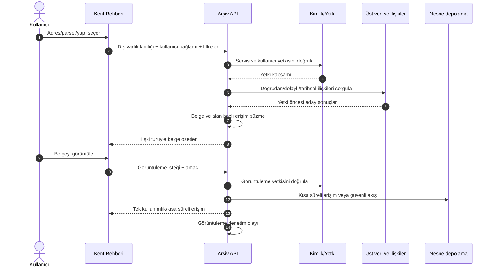

# Sivas Belediyesi Dijital Arşiv — Kent Rehberi Entegrasyon Sözleşmesi

**Belge durumu:** Hedef API ve veri sözleşmesi taslağı  
**Sürüm:** 0.1  
**Tarih:** 29 Temmuz 2026  
**Taraflar:** Kent Rehberi/CBS sistemi ve Dijital Arşiv Sistemi

> Uç noktalar ve alan adları hedef sözleşmedir; mevcut üretim API’si olarak yorumlanmamalıdır. CBS dış kimlikleri, kimlik doğrulama yöntemi ve ağ topolojisi ilgili ekiplerle kesinleştirilecektir.

## 1. Amaç

Kent Rehberi’nde seçilen adres, parsel veya yapı için ilişkili arşiv belgelerini yetki dâhilinde çağırmak; kullanıcıya ilişkinin niteliğini göstererek güvenli belge görüntüleme sağlamak.

## 2. Kapsam

### Kapsam içi

- Parsel kimliğiyle belge sorgulama
- Adres kimliğiyle belge sorgulama
- Yapı kimliğiyle belge sorgulama
- Doğrudan, dolaylı, tarihsel ve mekânsal ilişkileri ayırma
- Müdürlük, belge türü ve tarih filtreleri
- Kullanıcı yetkisine göre sonuç süzme
- Güvenli belge görüntüleme
- Sorgu ve görüntüleme denetim kaydı

### İlk sürümde kapsam dışı

- Kent Rehberi’nin nesne depolamaya doğrudan bağlanması
- Serbest metin adresin tek entegrasyon anahtarı olması
- Arşiv belgesinin Kent Rehberi veritabanına kopyalanması
- Kent Rehberi’nin arşiv üst verisini yetkisiz güncellemesi
- OCR metin eşleşmesinin otomatik olarak doğrulanmış hukuki ilişki sayılması

## 3. Temel ilkeler

1. Görünen `32 ada / 2 parsel` metni yerine mümkünse sabit `parcel_external_id` kullanılır.
2. Her dış kimlik `source_system + external_id` birleşimiyle değerlendirilir.
3. Kent Rehberi servis kimliği, son kullanıcı yetkisinin yerine geçmez.
4. Arşiv API tüm yetki ve veri sınıfı kurallarını kendisi uygular.
5. Yetkisiz kayıtlar toplam sayı veya hata farkı üzerinden sızdırılmaz.
6. İlişkinin kaynağı ve doğrulama durumu kullanıcıya açıklanır.
7. Dosya erişimi kısa süreli, amaçla sınırlı ve denetlenebilir olur.
8. Eski/yeni parsel ilişkileri güncel parselin üzerine yazılmaz.

## 4. Sistem akışı



## 5. Kimlik sözleşmesi

| Varlık | Alan | Kaynak | Zorunluluk |
|---|---|---|---|
| Parsel | `parcel_external_id` | Kent Rehberi/CBS | Tercih edilen zorunlu anahtar |
| Adres | `address_external_id` | Kent Rehberi/CBS | Adres sorgusunda zorunlu |
| Yapı | `building_external_id` | Kent Rehberi/CBS | Yapı sorgusunda zorunlu |
| Kaynak sistemi | `source_system` | Entegrasyon yapılandırması | Zorunlu |
| Geometri sürümü | `geometry_version` | CBS | Mekânsal eşleşmede önerilir |
| Kullanıcı | `subject_id` | Kurumsal kimlik | Zorunlu |
| Kullanıcı birimi | `department_id` | Personel/kimlik | Yetki kararında zorunlu |
| İstek kimliği | `request_id` | Çağıran sistem | Zorunlu; uçtan uca izleme |

Ada, parsel, mahalle ve adres metni görüntüleme/teşhis amacıyla gönderilebilir; kimlik mevcutken ana eşleştirme anahtarı değildir.

## 6. Hedef API

Temel yol:

```text
/api/integrations/kent-rehberi/v1
```

### 6.1 Parselle ilişkili belgeler

```http
GET /api/integrations/kent-rehberi/v1/parcels/{sourceSystem}/{parcelExternalId}/documents
```

Önerilen sorgu parametreleri:

| Parametre | Açıklama |
|---|---|
| `relationScope` | `direct`, `historical`, `spatial`, `all` |
| `documentType` | Belge türü kodu |
| `department` | Müdürlük kodu |
| `dateFrom`, `dateTo` | Belge tarih aralığı |
| `verification` | `verified`, `suggested`, `all` |
| `cursor` | Sayfalama imleci |
| `limit` | Üst sınırı sunucu belirler |

### 6.2 Adresle ilişkili belgeler

```http
GET /api/integrations/kent-rehberi/v1/addresses/{sourceSystem}/{addressExternalId}/documents
```

### 6.3 Yapıyla ilişkili belgeler

```http
GET /api/integrations/kent-rehberi/v1/buildings/{sourceSystem}/{buildingExternalId}/documents
```

### 6.4 Belge görüntüleme bileti

```http
POST /api/integrations/kent-rehberi/v1/documents/{documentId}/view-ticket
```

İstek:

```json
{
  "purpose": "PARCEL_RESEARCH",
  "requestId": "kr-2026-07-29-000123"
}
```

Yanıt kısa süreli bir arşiv görüntüleyici URL’si veya güvenli dosya akışı verir. Kalıcı S3 URL’si döndürülmez.

## 7. Örnek belge sorgu yanıtı

```json
{
  "requestId": "kr-2026-07-29-000123",
  "entity": {
    "type": "PARCEL",
    "sourceSystem": "KENT_REHBERI",
    "externalId": "847392",
    "label": "Kandemir Mahallesi 32 Ada 2 Parsel"
  },
  "items": [
    {
      "documentId": "018f-example",
      "archiveReferenceNo": "ARS-2026-6C472023",
      "documentType": {
        "code": "ENCUMEN_KARARI",
        "label": "Encümen kararı"
      },
      "department": {
        "code": "YAZI_ISLERI",
        "label": "Yazı İşleri Müdürlüğü"
      },
      "documentDate": "1996-09-11",
      "subject": "İmar uygulamasına ilişkin karar",
      "relation": {
        "type": "SUBJECT",
        "scope": "DIRECT",
        "source": "HUMAN_VERIFIED",
        "verificationStatus": "VERIFIED"
      },
      "access": {
        "canView": true,
        "canDownload": false,
        "masked": false
      }
    }
  ],
  "page": {
    "nextCursor": null,
    "hasMore": false
  }
}
```

Yanıtta OCR kanıt metni veya kişisel alanlar varsayılan olarak verilmez. Gerekli özet alanları veri sınıfı ve yetkiye göre sunucu belirler.

## 8. İlişki kapsamları

| Kapsam | Anlam | Varsayılan sunum |
|---|---|---|
| `DIRECT` | Varlık belgenin ana konusu veya doğrulanmış doğrudan bağlantısı | İlk grupta |
| `INDIRECT` | Ek, komşu, taraf veya başka bağlam | Ayrı etiket |
| `HISTORICAL` | Eski/yeni parsel veya tarihsel adres üzerinden | Açıklamayla |
| `SPATIAL` | Geometri kesişimi/yakınlığıyla önerilen | Öneri, doğrulanmış sayılmaz |
| `TEXT_ONLY` | Yalnız OCR/tam metinde geçen | En düşük güvenli öneri |

Kent Rehberi arayüzü bu kapsamları tek ve belirsiz sonuç listesine dönüştürmemelidir.

## 9. Parsel tarihçesi

Güncel parsel sorgusunda tarihsel belgelerin bulunabilmesi için:

1. CBS, parsel soy ilişkilerini dış kimliklerle sunar veya sürümlü aktarır.
2. Arşiv `SUBDIVISION`, `MERGE`, `RENUMBER` ve benzeri olayları ayrı kayıt olarak saklar.
3. Sorgu `relationScope=historical` içerdiğinde kontrollü soy takibi yapılır.
4. Sonuçta güncel parsel ile belgedeki tarihsel parsel ayrı gösterilir.
5. Döngü, aşırı derinlik ve veri kalitesi sorunlarına karşı sınır uygulanır.

CBS yetkili tarihçe sağlamıyorsa OCR veya kullanıcı eşleştirmesi `suggested` olarak kalır.

## 10. Mekânsal sorgu

Mekânsal sorgu ikinci aşama yeteneğidir. Aşağıdaki durumlarda kullanılabilir:

- Parselle kesişen yol/altyapı çalışma belgeleri
- Yapı geometrisine bağlı raporlar
- Bir güzergâh veya proje alanına bağlı belgeler
- Adres kimliği olmayan tarihsel kayıtlarda konum önerisi

Geometri eşleşmesi tek başına hukuki ilişki oluşturmaz. Koordinat referans sistemi, tolerans, geometri sürümü ve eşleşme kuralı sonuçla kaydedilir.

## 11. Kimlik doğrulama ve yetkilendirme

- Servisler arası bağlantı karşılıklı TLS, özel ağ ve/veya kurumca onaylı servis kimliği kullanır.
- Son kullanıcı kimliği imzalı ve güvenilir bir kimlik belirteciyle aktarılır.
- İstemcinin gönderdiği müdürlük veya rol bilgisine tek başına güvenilmez.
- Arşiv sistemi kullanıcı kapsamını yetkili kimlik/personel kaynağından doğrular.
- Belge listesi, özet alanları, görüntüleme ve indirme ayrı yetkilerdir.
- Sistem yöneticisi olması otomatik olarak bütün belge içeriğini görme hakkı doğurmaz.
- Görüntüleme bileti kısa ömürlü, amaçla sınırlı ve yeniden kullanım kısıtlı olur.

Kesin kimlik teknolojisi bilgi işlem ve güvenlik tasarımında kararlaştırılır.

## 12. Hata sözleşmesi

Örnek hata gövdesi:

```json
{
  "error": {
    "code": "ENTITY_NOT_AVAILABLE",
    "message": "İstenen kayıt kullanılamıyor.",
    "requestId": "kr-2026-07-29-000123"
  }
}
```

| HTTP | Kod | Kullanım |
|---|---|---|
| 400 | `INVALID_REQUEST` | Biçim veya zorunlu alan sorunu |
| 401 | `AUTHENTICATION_REQUIRED` | Geçerli kimlik yok |
| 403 | `ACCESS_DENIED` | İşleme yetki yok |
| 404 | `ENTITY_NOT_AVAILABLE` | Yok veya görünmesi yetkisiz |
| 409 | `SOURCE_VERSION_CONFLICT` | CBS sürüm uyuşmazlığı |
| 429 | `RATE_LIMITED` | Kota aşıldı |
| 503 | `DEPENDENCY_UNAVAILABLE` | Arşiv/CBS bağımlılığı kullanılamıyor |

404 yanıtı, yetkisiz kayıt varlığını doğrulayacak ayrıntı içermez.

## 13. Senkronizasyon ve veri sahipliği

- CBS adres, parsel, yapı dış kimliği ve geometrisinin yetkili sahibidir.
- Arşiv belge, belge-varlık ilişkisi, kanıt ve doğrulama durumunun sahibidir.
- Kent Rehberi arşiv belgesini kopyalamaz; özet ve erişim bileti alır.
- CBS kaydı değiştiğinde dış kimlik mümkünse sabit kalır; değişim olayı sürümlü aktarılır.
- Toplu eşleştirme yapılacaksa idempotent istek anahtarı ve sonuç raporu kullanılır.

## 14. Denetim ve gözlemlenebilirlik

Her istek en az:

- `request_id`
- servis ve kullanıcı kimliği
- sorgulanan varlık türü ve iç referansı
- kullanılan filtreler
- sonuç sayısı
- süre ve hata kodu
- görüntülenen/indirilen belge
- iş amacı

bilgileriyle denetlenir. Kişisel veri ve erişim belirteçleri uygulama loguna açık yazılmaz.

## 15. Hizmet hedefleri

Kesin değerler yük testiyle belirlenir. İlk hedefler:

- Sayfalı belge özet sorgularında etkileşimli kullanıcı deneyimi
- Aynı `request_id` için uçtan uca izlenebilirlik
- Kota, zaman aşımı ve kontrollü tekrar deneme
- API sürüm uyumluluğu
- Büyük dosyanın Kent Rehberi uygulama sunucusundan gereksiz geçirilmemesi
- Arşiv kullanılamadığında anlaşılır ve güvenli hata durumu

## 16. Kabul senaryoları

1. Sabit CBS parsel kimliğiyle doğrudan belgeler bulunur.
2. Bir belgede birden fazla parsel ilişkisi doğru döner.
3. Güncel parsel sorgusunda tarihsel ilişki ayrı etiketle gösterilir.
4. Yalnız OCR eşleşmesi doğrulanmış ilişki gibi sunulmaz.
5. Yetkisiz kullanıcı belge varlığını ve özetini göremez.
6. Görüntüleme bileti süresi dolduğunda kullanılamaz.
7. Kent Rehberi doğrudan S3 kimlik bilgisi veya kalıcı URL almaz.
8. İstek ve görüntüleme olayı denetim kaydına bağlanır.
9. CBS dış kimliği değişim/sürüm senaryosu kontrollü ele alınır.
10. Hata ve zaman aşımı Kent Rehberi arayüzünde güvenli biçimde gösterilir.

## 17. Açık kararlar

- Kent Rehberi’nin gerçek kaynak sistem kodu ve dış kimlik alanları
- Kullanıcı kimliğinin aktarım yöntemi
- Kurumsal servis kimliği ve ağ topolojisi
- Geometri koordinat referans sistemi
- Parsel tarihçesi servisinin kapsamı
- Kent Rehberi’nde gösterilecek belge özet alanları
- İndirme yetkisi ve iş amacı kodları
- API performans, kota ve kullanılabilirlik hedefleri
- CBS ve arşiv ekipleri için olay/arıza sorumlulukları

