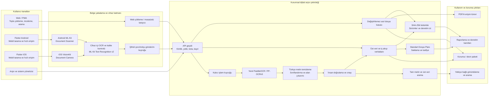
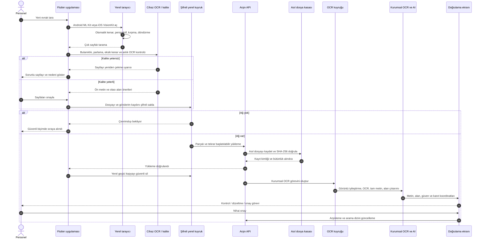
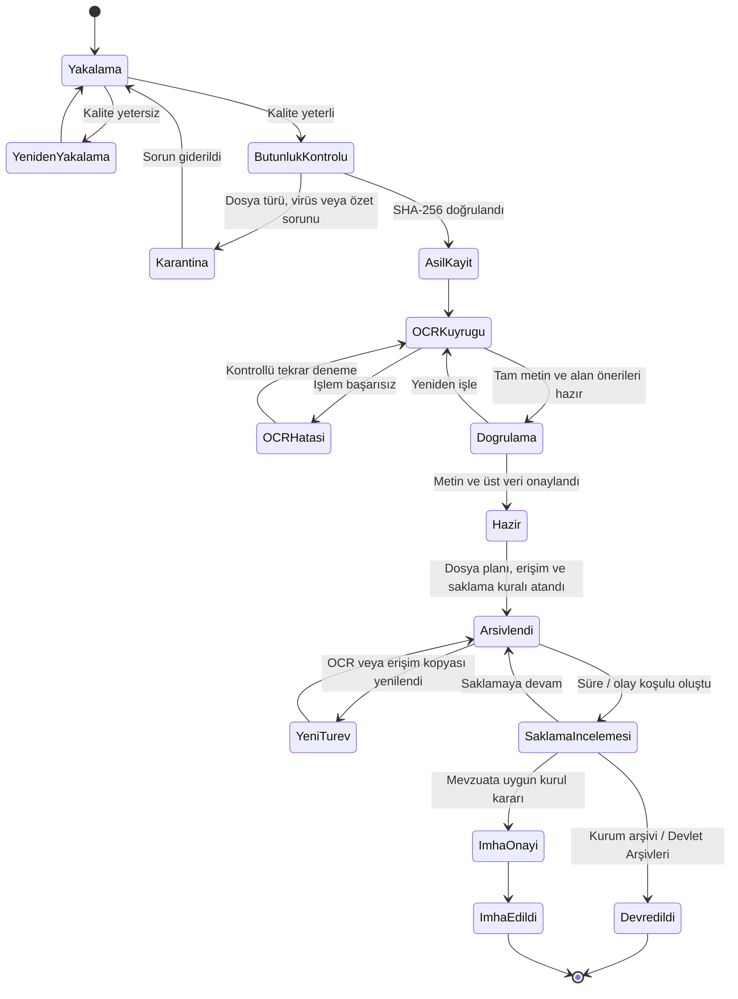
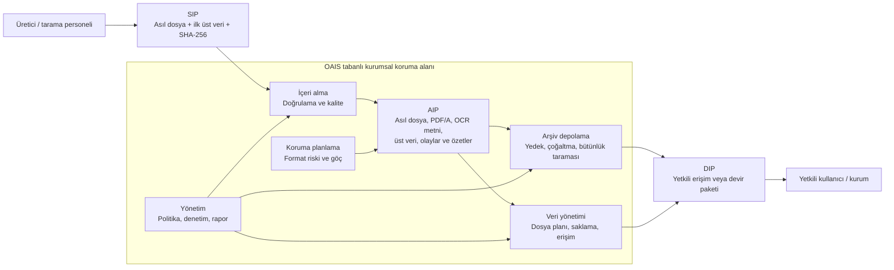
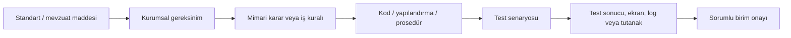
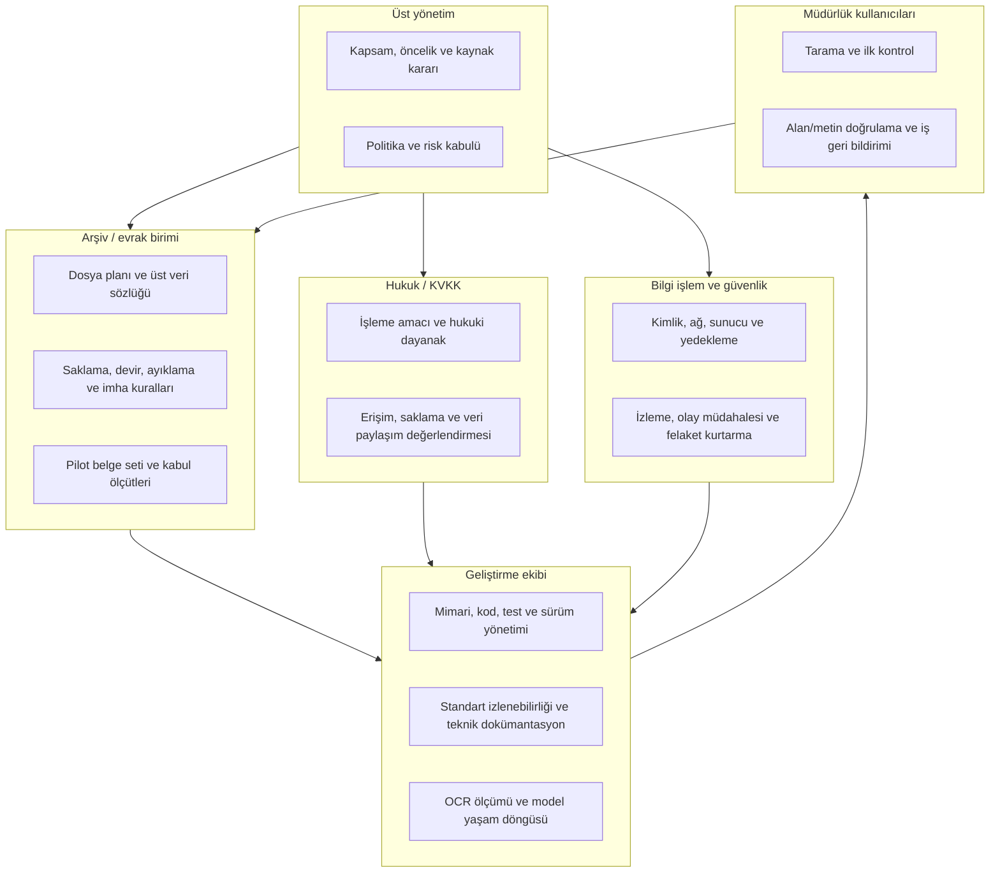
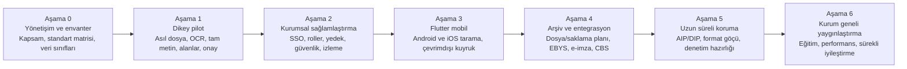

# Sivas Belediyesi Dijital Arşiv Sistemi

## Hedef Mimari, Standartlar, Mobil Uygulama ve Yol Haritası

**Belge durumu:** Kavramsal tasarım ve yönetim görüşmesi taslağı  
**Tarih:** 17 Temmuz 2026  
**Amaç:** Uygulamaya geçmeden önce sistemin nasıl çalışacağını, hangi standartlara göre geliştirileceğini, mobil evrak taramasının mimarideki yerini ve ilerleyen aşamalardaki beklentileri ortak bir çerçevede tanımlamak.

> Bu belge bir uygunluk veya sertifikasyon beyanı değildir. Standartlara uyum; gereksinim-kanıt matrisi, kurum içi hukuk/arşiv/bilgi işlem onayı, test kayıtları ve gerekiyorsa bağımsız denetim sonucunda beyan edilecektir.

---

## 1. Yönetici özeti

Kurulacak ürün yalnızca dosya yüklenen bir web ekranı olmayacaktır. Aynı **kurumsal arşiv çekirdeğine** bağlanan üç kullanım kanalı olacaktır:

1. Web/PWA: toplu yükleme, ayrıntılı inceleme, tasnif, arama ve yönetim.
2. Flutter Android/iOS uygulaması: sahada çok sayfalı evrak tarama, kalite kontrolü, çevrimdışı kuyruk ve hızlı sorgulama.
3. Arka plan işlem servisleri: yerel OCR, yapay zekâ destekli alan çıkarımı, arama dizini, saklama planı ve bütünlük denetimi.

Sistemin temel ilkeleri:

- Asıl belge değiştirilemez biçimde korunur.
- OCR metni, PDF/A, küçük resim ve benzeri çıktılar asıl belgeden üretilmiş türevlerdir.
- Her belge SHA-256 özeti, sürüm bilgisi ve denetim iziyle takip edilir.
- Yapay zekâ öneride bulunur; kritik alanlarda nihai karar yetkili personeldedir.
- Mobil cihazda yapılan OCR hızlı ön izleme sağlar; kurumsal ve tutarlı nihai OCR merkezi/yerel sunucu hattında tekrar çalışır.
- Dosya planı, saklama süresi, erişim yetkisi ve KVKK kuralları sonradan eklenen özellikler değil, belge modelinin parçasıdır.
- Mobilde çekilen belge, sunucu tarafından alınıp bütünlüğü doğrulanana kadar resmî arşiv kaydı sayılmaz.

---

## 2. Sistem bağlamı ve hedef mimari

### Mimari karar

Flutter, ortak kullanıcı deneyimi ve iş akışları için kullanılacaktır. Kamera ve belge tarama katmanında platformların resmî yerel yeteneklerine erişilecektir:

| Katman | Android | iOS |
|---|---|---|
| Uygulama arayüzü | Flutter | Flutter |
| Belge tarama | Google ML Kit Document Scanner | Apple VisionKit Document Camera |
| Anlık cihaz içi OCR | ML Kit Text Recognition v2 | ML Kit Text Recognition v2 |
| Flutter ile yerel bağlantı | Kotlin platform kanalı | Swift platform kanalı |
| Nihai kurumsal OCR | Yerel/sunucu PaddleOCR PP-OCRv5 | Yerel/sunucu PaddleOCR PP-OCRv5 |

Google ML Kit’in hazır **Document Scanner** akışı Android’e özeldir. Bu nedenle iOS tarafında aynı işlev için Apple VisionKit kullanılacaktır. Topluluk Flutter paketlerine bağımlı bir çekirdek yerine, küçük ve test edilebilir Kotlin/Swift uyarlayıcıları geliştirmek bakım riskini azaltır.

---

## 3. Mobil evrak tarama akışı

### Mobil tarafta zorunlu kalite kapıları

- Belgenin dört kenarının bulunması ve perspektif düzeltmesi.
- Bulanıklık, düşük çözünürlük, parlama, gölge ve parmak kapatma tespiti.
- Çok sayfalı belgede eksik/tekrarlı sayfa uyarısı.
- Kullanıcıya taramayı büyüterek inceleme ve yeniden çekme imkânı.
- Sayfaların sıralanması, döndürülmesi ve silinmesi.
- Çevrimdışı bekleyen belgenin cihazda şifreli tutulması.
- Başarılı yükleme ve sunucu bütünlük alındısından sonra yerel geçici dosyanın silinmesi.
- Kişisel verinin telefon galerisine kendiliğinden kaydedilmemesi.
- Kayıp/çalıntı cihaz, ekran görüntüsü ve oturum süresi politikalarının kurum tarafından belirlenmesi.

### Neden çift aşamalı OCR?

| Aşama | Amaç | Karar değeri |
|---|---|---|
| Cihaz içi OCR | Kullanıcıya saniyeler içinde okunabilirlik ve alan ön izlemesi vermek | Geçici öneri |
| Kurumsal OCR | Tüm cihazlarda aynı model, sözlük, iyileştirme ve denetim kaydıyla sonuç üretmek | Esas işleme sonucu |
| İnsan doğrulaması | Kritik alanları ve düşük güvenli metni belge görüntüsüyle karşılaştırmak | Nihai onay |

Bu model; cihaz farklarının doğurduğu tutarsızlığı azaltır, bulut API maliyetini kontrol altında tutar ve düzeltmelerden kuruma özgü öğrenme veri seti oluşturur.

---

## 4. Belgenin yaşam döngüsü

**Değişmezlik kuralı:** Arşivlenmiş asıl dosya üzerine yazılmaz. OCR düzeltmesi, üst veri güncellemesi veya yeni PDF/A üretimi yeni bir sürüm ya da türev kayıt oluşturur; önceki durum ve işlemi yapan kişi denetim izinde korunur.

---

## 5. Uzun süreli koruma ve OAIS eşlemesi

- **SIP:** Sisteme kabul için gönderilen paket.
- **AIP:** Uzun süreli koruma için asıl belge, türevler, üst veri, işlem olayları ve bütünlük özetlerini içeren paket.
- **DIP:** Yetkili kullanıcıya, başka kuruma veya Devlet Arşivlerine sunulan erişim/devir paketi.

---

## 6. Standart ve mevzuat omurgası

### Türkiye

| Kaynak | Sisteme yansıması | Üretilecek kanıt/doküman |
|---|---|---|
| [TS 13298 Elektronik Belge ve Arşiv Yönetim Sistemi](https://www.tse.org.tr/elektronik-belge-yonetim-sistemi-tse-urun-belgelendirmesi/) | Belge yönetimi, diplomatik özellikler, güvenli e-imza/e-mühür ve sistem gereksinimleri | TS 13298 madde-gereksinim-test matrisi |
| [Devlet Arşiv Hizmetleri Hakkında Yönetmelik](https://www.devletarsivleri.gov.tr/varliklar/dosyalar/mevzuat/arsivhizmetleri.pdf) | Arşiv süreçleri, dosya kodu, devir, ayıklama ve imha | Arşiv iş akışları, yetki ve kurul kayıtları |
| [Devlet Arşivleri Dosya Planı Rehberi](https://www.devletarsivleri.gov.tr/varliklar/dosyalar/formlar/dosyaplan%C4%B1rehberi1.1.pdf) ve [güncel SSDP duyurusu](https://www.devletarsivleri.gov.tr/Sayfalar/Haberler/Duyuru.aspx?ID=6279) | Standart Dosya Planı kodu zorunlu üst veri olur | Sürümlü dosya planı sözlüğü ve eşleme kuralları |
| [Saklama Planları Rehberi](https://www.devletarsivleri.gov.tr/varliklar/dosyalar/formlar/saklamaplanlar%C4%B1rehberi.pdf) | Her dosya planı kalemi saklama ve tasfiye kuralıyla ilişkilendirilir | Saklama planı, süre başlangıç olayı ve tasfiye kararı |
| [6698 sayılı KVKK](https://www.kvkk.gov.tr/Icerik/6649/Personal-Data-Protection-Law) | Amaçla sınırlılık, veri minimizasyonu, erişim kontrolü ve işlem güvenliği | Veri envanteri, rol matrisi, saklama-silme ve ihlal prosedürü |

### Uluslararası

| Standart | Sisteme yansıması |
|---|---|
| [ISO 15489-1:2016](https://www.iso.org/standard/62542.html) | Belgenin oluşturulması/yakalanması, sorumluluklar, kontroller ve yaşam döngüsü |
| [ISO 23081-1:2017](https://www.iso.org/standard/73172.html) | Belge, ajan, işlem ve ilişki üst verilerinin yönetimi |
| [ISO 14721:2025 OAIS](https://www.iso.org/standard/87471.html) | SIP/AIP/DIP paketleri ve uzun süreli dijital koruma işlevleri |
| [ISO 19005 PDF/A](https://www.iso.org/standard/38920.html) | Uzun süreli erişim kopyalarının standartlaştırılması |
| [ISO 14641:2018](https://www.iso.org/standard/74338.html) | Okunabilirlik, bütünlük ve izlenebilirliği koruyan elektronik arşiv sistemi |
| [ISO/TR 13028:2010](https://www.iso.org/standard/52391.html) | Güvenilir sayısallaştırma, erişilebilirlik ve delil değeri için uygulama rehberi |
| [ISO 13008:2022](https://www.iso.org/cms/%20render/live/en/sites/isoorg/contents/data/standard/07/55/75569.html) | Format dönüşümü/göç sırasında özgünlük, bütünlük ve kullanılabilirliğin korunması |
| [ISO/IEC 27001:2022](https://www.iso.org/contents/news/2022/10/new-iso-iec-27001.html) | Bilgi güvenliği risk yönetimi; gizlilik, bütünlük ve erişilebilirlik |
| [PREMIS 3](https://www.loc.gov/standards/premis/) | Koruma üst verisinde nesne, olay, ajan ve hak kayıtları |
| [METS](https://www.loc.gov/standards/mets/) | Çok dosyalı arşiv paketlerinde yapısal, idari ve betimleyici üst veri |

### Standartlar nasıl dokümante edilecek?

Her standart için şu zincir korunacaktır:

Bu izlenebilirlik matrisi sayesinde “standarda uygun geliştirildi” ifadesinin hangi gereksinim, uygulama ve kanıtla desteklendiği gösterilebilir.

---

## 7. Programdan beklenen yetenekler

### 7.1 Belge kabul ve sayısallaştırma

- Web, mobil, toplu klasör, tarayıcı ve entegrasyon API’sinden belge kabulü.
- JPEG, PNG, TIFF ve PDF doğrulama; zararlı içerik taraması.
- Çok sayfalı tarama, otomatik kenar/perspektif düzeltme ve kalite puanı.
- SHA-256 ile tekrar belge ve bütünlük kontrolü.
- Asıl dosyanın değiştirilemez nesne olarak saklanması.
- Tarama kaynağı, cihaz, zaman, kullanıcı ve kalite ölçümlerinin kaydı.

### 7.2 OCR, yapay zekâ ve tasnif

- Türkçe tam metnin temiz ve paragraf düzenine yakın çıkarılması.
- Belge türü, müdürlük, konu, tarih, sayı, ada, parsel, mahalle ve muhatap gibi alanların çıkarılması.
- Her alan için güven değeri ve görüntü üzerindeki kanıt koordinatı.
- Kurumsal sözlüklerle yazım ve alan doğrulaması.
- Belge türüne özel şemalar ve zorunlu alan kuralları.
- Düşük güven veya tutarsızlıkta otomatik insan inceleme görevi.
- Kullanıcı düzeltmelerinin model geliştirme veri setine sürümlü ve anonimleştirme kurallarıyla alınması.
- Model adı, sürümü, sözlük sürümü ve işlem süresinin her sonuçla kaydedilmesi.
- Yapay zekânın sessizce asıl belgeyi veya onaylı metni değiştirememesi.

### 7.3 Arama ve erişim

- Tam metin, üst veri ve birleşik arama.
- Türkçe karakter, yazım farkı ve yakın eşleşme desteği.
- Müdürlük, tarih aralığı, belge türü, dosya kodu, mahalle, ada/parsel ve kişi filtreleri.
- Sonucun geçtiği metin bölümünü bağlamıyla gösterme.
- Kaydedilmiş sorgular ve yetkiye bağlı sonuç kümeleri.
- Belge içi eşleşmeye gitme ve kanıt alanını görüntü üzerinde vurgulama.
- Dışa aktarımın yetki, amaç ve denetim kaydına bağlanması.

### 7.4 Arşiv ve uzun süreli koruma

- Standart Dosya Planı ve saklama planı ilişkisinin zorunlu tutulması.
- PDF/A erişim türevi, OCR metni, küçük resim ve arşiv paketi üretimi.
- Periyodik bütünlük taraması ve bozulma uyarısı.
- En az iki ayrı hata alanında yedek; düzenli geri yükleme tatbikatı.
- Format eskimesi takibi ve kontrollü göç.
- Devir, ayıklama ve imha için çok aşamalı yetki ve kurul tutanağı.
- Yasal bekletme durumunda imha sürecini durdurma.

### 7.5 Güvenlik ve KVKK

- Kurumsal SSO/LDAP/AD entegrasyonu ve çok faktörlü kimlik doğrulama seçeneği.
- Rol, müdürlük, belge sınıfı ve işlem bazlı sunucu tarafı yetkilendirme.
- Aktarımda ve depolamada şifreleme.
- Kişisel verinin varsayılan olarak kurum dışı OCR servisine gönderilmemesi.
- Değiştirilemez denetim kayıtları; görüntüleme ve dışa aktarmanın da kaydedilmesi.
- Veri minimizasyonu, maskeleme, saklama sonunda silme/imha ve erişim gözden geçirmesi.
- Mobil cihazdaki geçici verinin şifrelenmesi ve doğrulanmış yüklemeden sonra temizlenmesi.
- Güvenlik olayı, hesap kapatma, cihaz kaybı ve erişim iptali prosedürleri.

### 7.6 İşletim ve raporlama

- OCR kuyruğu, hata karantinası, kontrollü tekrar deneme ve görev önceliği.
- İşlem süresi, kuyruk uzunluğu, hata oranı ve servis sağlığı göstergeleri.
- Günlük/aylık taranan sayfa, doğrulama bekleyen belge ve personel iş yükü.
- Belge türü ve alan bazında OCR doğruluk ölçümleri.
- Kullanıcı düzeltme oranı ve model sürümleri arasında karşılaştırma.
- Yaklaşan saklama/tasfiye işleri ve bütünlük taraması raporları.
- Yedekleme ve geri yükleme başarı raporları.

### 7.7 Gelecekteki entegrasyonlar

- Mevcut EBYS ve e-Yazışma süreçleri.
- Güvenli elektronik imza, elektronik mühür ve zaman damgası.
- KEP.
- CBS/GIS ve ada-parsel servisleri.
- Belediye kimlik ve personel sistemleri.
- Barkod/QR ile fiziksel-dijital dosya eşleştirme.
- Devlet Arşivlerine standart paketle devir.

---

## 8. Roller ve sorumluluklar

Standartlara uyum yalnızca yazılım ekibinin görevi değildir. Yazılım gereksinimleri uygular ve kanıt üretir; dosya planı ile saklama kararlarını arşiv birimi, kişisel veri ve hukuki dayanakları hukuk/KVKK birimi, altyapı ve güvenlik kontrollerini bilgi işlem belirler.

---

## 9. Aşamalı yol haritası

| Aşama | Teslimat | Aşamadan çıkış ölçütü |
|---|---|---|
| 0 — Yönetişim | Belge envanteri, veri sınıfları, rol matrisi, standart izlenebilirlik tablosu | Arşiv, hukuk/KVKK ve bilgi işlem kapsamı onaylar |
| 1 — Dikey pilot | Gerçek belgede yükleme, değişmez asıl, OCR tam metin, alan çıkarımı, insan onayı ve arama | Temsilî pilot sette hedef doğruluk, süre ve kullanıcı kabulü sağlanır |
| 2 — Sağlamlaştırma | Kurumsal kimlik, sunucu yetkileri, yedek/geri yükleme, izleme ve güvenlik testleri | Yetki, bütünlük ve geri dönüş testleri geçer |
| 3 — Flutter mobil | Android ML Kit, iOS VisionKit, cihaz OCR, çevrimdışı ve güvenli yükleme | Her iki platformda saha pilotu ve cihaz veri temizleme testi geçer |
| 4 — Entegrasyon | Dosya/saklama planı, EBYS, imza, CBS ve dış sistem sözleşmeleri | Uçtan uca iş akışları kurum sahipleri tarafından onaylanır |
| 5 — Koruma | PDF/A politikası, PREMIS olayları, AIP/DIP paketleri ve format göç planı | Örnek devir/geri yükleme ve bütünlük tatbikatı tamamlanır |
| 6 — Yaygınlaştırma | Eğitim, destek, performans kapasitesi ve sürekli ölçüm | Birim bazlı geçiş ve hizmet seviyesi hedefleri sağlanır |

Takvim, pilot belge hacmi, kurum altyapısı ve entegrasyonların hazır oluşu belirlendikten sonra ayrıca çıkarılmalıdır. Aşamaların sırası sabit bir “şelale” değildir; ancak güvenlik, veri modeli ve standart kararları tamamlanmadan kurum geneli yaygınlaştırmaya geçilmemelidir.

---

## 10. Başarı ölçütleri

Tek bir “OCR doğruluğu” yüzdesi yeterli değildir. Aşağıdaki göstergeler birlikte izlenmelidir:

| Alan | Örnek ölçüm |
|---|---|
| Yakalama kalitesi | Yeniden çekilen sayfa oranı, bulanıklık/parlama oranı |
| OCR tam metin | CER/WER, belge türü ve tarama kalitesi bazında |
| Kritik alanlar | Ada, parsel, tarih, sayı, müdürlük ve muhatap için kesinlik/duyarlılık |
| İnsan emeği | Belge başına düzeltme süresi ve düzeltilen karakter/alan oranı |
| Hız | Yüklemeden ön izlemeye ve onaya hazır duruma kadar geçen süre |
| Arama | Aranan belgenin ilk sonuçlarda bulunma oranı |
| Güvenlik | Yetkisiz erişim denemesi, ayrıcalıklı işlem ve dışa aktarım denetimi |
| Koruma | Bütünlük taraması başarısı, yedekten geri dönüş süresi ve başarısı |
| Mobil | Başarılı çevrimdışı senkronizasyon, yükleme tekrar deneme ve cihaz temizleme oranı |
| Kullanıcı kabulü | Görev tamamlama süresi, hata oranı ve birim geri bildirimi |

Hedef değerler, belediyenin gerçek ve temsilî pilot belge seti üzerinde başlangıç ölçümü yapıldıktan sonra kurumla birlikte belirlenecektir.

---

## 11. Her sürümde üretilecek dokümanlar

- Gereksinim ve standart izlenebilirlik matrisi.
- Mimari karar kayıtları.
- Üst veri sözlüğü ve zorunlu alan kuralları.
- Standart Dosya Planı ve saklama planı eşleme sürümleri.
- Dosya biçimi ve PDF/A üretim politikası.
- Tarama ve kalite güvence prosedürü.
- OCR/model kartı, veri seti tanımı ve karşılaştırmalı ölçüm raporu.
- Yetki matrisi, veri akış haritası ve KVKK veri envanteri.
- Tehdit modeli, güvenlik testleri ve olay müdahale planı.
- Yedekleme, geri yükleme ve felaket kurtarma planı/tatbikat raporu.
- API ve entegrasyon sözleşmeleri.
- Kullanıcı, arşiv yöneticisi ve sistem yöneticisi kılavuzları.
- Sürüm notları, değişiklik kayıtları ve eğitim materyalleri.

---

## 12. İlk alınması gereken kurumsal kararlar

1. Pilot hangi müdürlük ve hangi 3–5 belge türüyle başlayacak?
2. Bu belge türlerinde zorunlu üst veri alanları nelerdir?
3. Standart Dosya Planı ve saklama planının kurumda yetkili kaynağı kimdir?
4. Mobil uygulamada yalnızca tarama mı, arama/onay da mı bulunacak?
5. Çevrimdışı belgenin cihazda tutulabileceği azami süre nedir?
6. Belediye içi sunucu, nesne depolama, yedek ve felaket kurtarma altyapısı nasıl sağlanacak?
7. Kurumsal kimlik sağlayıcı, rol ve müdürlük yetkileri hangi sistemden alınacak?
8. Mevcut EBYS, e-imza, KEP ve CBS entegrasyonlarının teknik sahipleri kimlerdir?
9. OCR başarı hedefi ve kritik alanlarda kabul edilebilir hata sınırı nedir?
10. Uyum onaylarında arşiv, hukuk/KVKK, bilgi işlem ve üst yönetim adına kimler sorumludur?

Bu kararlar alındığında kavramsal şema; teknik iş paketlerine, takvime, sorumlulara ve kabul testlerine dönüştürülebilir.

---

## 13. Temel mimari karar kayıtları

- **ADR-001 — Değiştirilemez asıl:** Yüklenen/taranan asıl belge üzerine yazılmaz; tüm işlemler türev veya yeni sürüm üretir.
- **ADR-002 — Çift aşamalı OCR:** Mobil OCR ön izleme içindir; kurumsal OCR ortak ve denetlenebilir esas sonucu üretir.
- **ADR-003 — Mobil kayıt sınırı:** Mobil tarama, sunucuda SHA-256 doğrulanıp kayıt alındısı dönene kadar arşiv kaydı değildir.
- **ADR-004 — Yerel platform köprüleri:** Flutter ortak istemcidir; Android tarayıcı Kotlin/ML Kit, iOS tarayıcı Swift/VisionKit üzerinden çalışır.
- **ADR-005 — Mahremiyet ve maliyet:** Varsayılan OCR kurum içinde çalışır; dış bulut servisi ancak açık hukuki/teknik politika ve yetkiyle kullanılabilir.
- **ADR-006 — İnsan denetimi:** Kritik veya düşük güvenli alanlarda insan onayı zorunludur; model sonucu tek başına hukuki kayıt oluşturmaz.
- **ADR-007 — Standart kanıtı:** Her gereksinim kod, test ve onay kanıtına bağlanmadan “uyumlu” olarak işaretlenmez.

---

## 14. Mobil teknoloji kaynakları

- [Google ML Kit Document Scanner — Android](https://developers.google.com/ml-kit/vision/doc-scanner/android)
- [Google ML Kit Document Scanner genel bakış](https://developers.google.com/ml-kit/vision/doc-scanner)
- [Google ML Kit Text Recognition v2](https://developers.google.com/ml-kit/vision/text-recognition/v2)
- [Apple VisionKit Document Camera](https://developer.apple.com/documentation/visionkit/vndocumentcameraviewcontroller/delegate)
- [Flutter platform channels](https://docs.flutter.dev/platform-integration/platform-channels)

