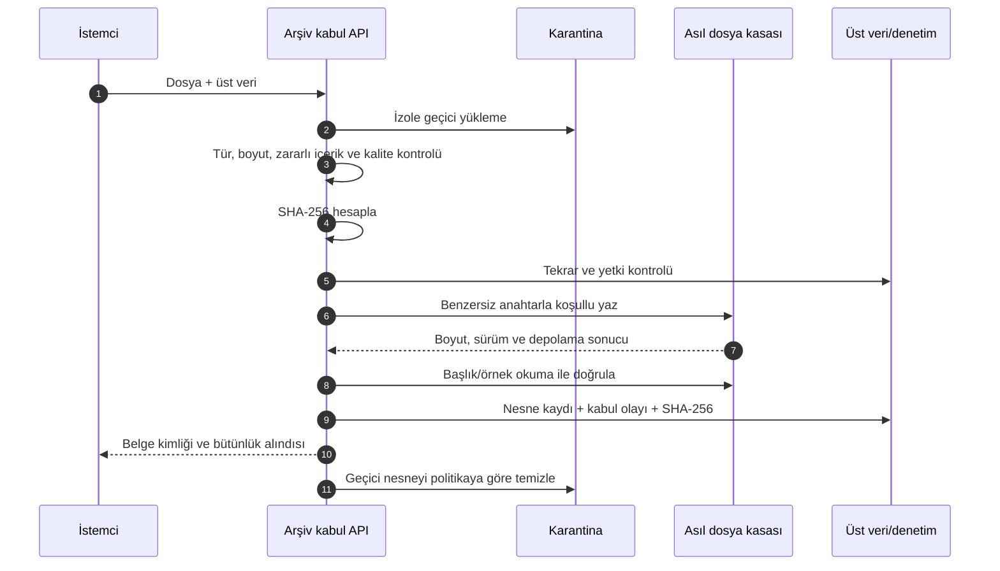

# Sivas Belediyesi Dijital Arşiv — S3 Depolama ve Değişmezlik Politikası

**Belge durumu:** Hedef politika taslağı — altyapı ve hukuk/arşiv onayı bekliyor  
**Sürüm:** 0.1  
**Tarih:** 29 Temmuz 2026  
**Kapsam:** Asıl dosyalar, türevler, erişim, bütünlük, saklama ve geri kazanım

> “S3 uyumlu” ifadesi tek başına güvenlik, değişmezlik veya mevzuat uyumu garantisi değildir. Üretim sağlayıcısı bu belgede tanımlanan uyumluluk, güvenlik ve işletim testlerinden geçmelidir.

## 1. Amaç

Bu politika; arşiv dosyalarının sağlayıcıdan bağımsız bir S3 API yaklaşımıyla güvenli, izlenebilir ve uzun süre korunmasını tanımlar. Üst veri ve iş akışı veritabanında; dosya içerikleri nesne depolamada tutulur.

## 2. Mimari sınır

| Katman | Saklanan içerik |
|---|---|
| PostgreSQL/üst veri | Belge, varlık, ilişki, yetki, iş akışı, nesne kayıtları |
| S3 uyumlu depolama | Asıl dosya, OCR çıktısı, PDF/A, küçük resim, paket |
| Arama dizini | Yetkiye uygun aranabilir metin ve filtre alanları |
| Denetim sistemi | Kabul, erişim, düzeltme, saklama ve tasfiye olayları |

Nesne deposu belge yönetim sisteminin kendisi değildir. Dosya planı, saklama, yetki ve denetim kararları uygulama katmanında yönetilir.

## 3. Temel ilkeler

1. Asıl dosya kabulden sonra değiştirilemez nesne olarak ele alınır.
2. OCR düzeltmesi veya yeni PDF/A, asıl dosyanın üzerine yazmaz.
3. Her nesnenin uygulama tarafından hesaplanan SHA-256 özeti veritabanında tutulur.
4. Nesne anahtarları kişisel veri veya iş sırrı içermez.
5. Uygulamalar kalıcı genel URL veya uzun ömürlü erişim anahtarı paylaşmaz.
6. Üretim erişimi en az ayrıcalık ve görev ayrılığıyla verilir.
7. Şifreleme, yedekleme, çoğaltma ve geri yükleme birlikte tasarlanır.
8. Sağlayıcı sürüm kimliği tek bütünlük kanıtı değildir.
9. Saklama süresi dolması kendiliğinden imha yetkisi vermez.
10. Sağlayıcı taşınabilirliği düzenli dışa aktarım ve geri yükleme testiyle doğrulanır.

## 4. S3 uyumluluk profili

Üretim sağlayıcısında en az şu yetenekler test edilir:

| Yetenek | Zorunluluk | Açıklama |
|---|---|---|
| Nesne yazma/okuma/başlık | Zorunlu | Temel S3 işlemleri |
| Çok parçalı yükleme | Zorunlu | Büyük dosya ve yeniden başlatma |
| Koşullu yazma | Zorunlu | Yanlışlıkla üzerine yazmayı önleme |
| Sunucu taraflı şifreleme | Zorunlu | Kurumun anahtar politikasına göre |
| Sürümleme | Üretim asıl kasasında zorunlu | Silme/üzerine yazma riskine karşı; ADR-016 |
| Object Lock/WORM | Üretim asıl kasasında zorunlu | ADR-016; R2 bucket lock mevzuatsal WORM sayılmaz |
| Yaşam döngüsü kuralları | Zorunlu | Türev/karantina ve maliyet yönetimi |
| Olay bildirimi | Önerilen | İşleme ve izleme entegrasyonu |
| Kısa süreli imzalı erişim | Zorunlu | Güvenli görüntüleme/indirme |
| Erişim logları | Zorunlu | Denetim ve olay inceleme |
| Çoğaltma | Üretim tasarımına bağlı | İkinci hata alanı/tesis |
| Bütünlük başlıkları | Yardımcı | Uygulama SHA-256’sının yerine geçmez |

Cloudflare R2 pilot uygulamasında kullanılabilir; üretim kararı sağlayıcı adı değil bu profil üzerinden verilir.

## 5. Nesne sınıfları ve ayrım

| Sınıf | İçerik | Değişmezlik | Örnek saklama yaklaşımı |
|---|---|---|---|
| `original` | Kabul edilmiş asıl PDF/JPEG/TIFF vb. | En yüksek | Kurumsal saklama kararıyla |
| `access` | Görüntüleme için optimize türev | Sürümlü | Yeniden üretilebilir |
| `ocr` | Metin, kelime kutusu, model çıktısı | Sürümlü | Model/kanıt süresiyle |
| `preservation` | PDF/A, AIP/DIP paketleri | Sürümlü/değişmez | Koruma planına göre |
| `thumbnail` | Küçük resim | Yeniden üretilebilir | Kısa/orta süre |
| `quarantine` | Kabul öncesi riskli içerik | İzole | Kısa ve sınırlı |
| `temporary` | Çok parçalı yükleme/işleme | Geçici | Otomatik temizleme |

Bu sınıflar ayrı bucket veya güçlü politika ayrımı olan ayrı öneklerle uygulanabilir. Üretim güvenlik tasarımı, asıl dosya ile geçici/karantina içeriğini aynı yetki alanında bırakmamalıdır.

## 6. Nesne anahtarı standardı

Örnek mantıksal yapı:

```text
originals/{tenant}/{document_uuid}/{binary_object_uuid}
derivatives/{tenant}/{document_uuid}/ocr/{version}/{binary_object_uuid}.json
derivatives/{tenant}/{document_uuid}/pdfa/{version}/{binary_object_uuid}.pdf
derivatives/{tenant}/{document_uuid}/thumbnail/{version}/{binary_object_uuid}.webp
quarantine/{tenant}/{ingest_uuid}/{binary_object_uuid}
```

Kurallar:

- Anahtarda kişi adı, T.C. kimlik numarası, açık adres, parsel veya belge konusu bulunmaz.
- Kullanıcı tarafından gönderilen dosya adı anahtar yapılmaz.
- Uzantı yalnız içerik türünü kolaylaştırmak için kullanılabilir; güvenlik doğrulaması değildir.
- Anahtarlar tahmin edilmesi güç sistem kimliklerinden oluşur.
- Belge referans numarası değişse bile nesne anahtarı değişmez.
- Aynı anahtara yeni içerik yazılmaz; yeni nesne kimliği üretilir.

Özgün dosya adı yalnız gerekli iş bağlamıyla, veri sınıfına uygun biçimde üst veride tutulur.

## 7. Asıl dosya kabul akışı



Kabul, nesne yazma ile veritabanı kaydı arasındaki hata durumlarını telafi edecek idempotent işlem tasarımı kullanır. Sahipsiz nesne ve dosyasız kayıt taramaları düzenli çalışır.

## 8. Nesne üst verisi ve veritabanı kaydı

Yetkili kayıt veritabanındadır. En az:

- `binary_object_id`
- `document_id`
- `object_class`
- `object_key`
- `storage_provider`
- `bucket_or_namespace`
- `storage_version_id`
- `media_type`
- `byte_size`
- `sha256`
- `encryption_status`
- `derived_from_id`
- `generator`
- `created_at`
- `retention_status`
- `legal_hold_status`

tutulur.

S3 nesne etiketleri veya metadata alanları kolaylık sağlar; tek doğruluk kaynağı sayılmaz ve hassas veri içermez.

## 9. Değişmezlik ve Object Lock/WORM

### 9.1 Uygulama düzeyi

- Asıl nesne anahtarına güncelleme işlemi yapılmaz.
- Yazma koşullu yapılır; mevcut anahtar varsa işlem başarısız olur.
- Asıl nesne için uygulama rolünde silme yetkisi bulunmaz.
- Düzeltme, yeni nesne ve yeni ilişki kaydı üretir.
- Her kabul ve türetme olayı denetim izine eklenir.

### 9.2 Depolama düzeyi

ADR-016 gereği üretim asıl kasasında sürümleme ve nesne bazlı Object Lock/WORM
zorunludur. Kabul edilmiş asıllar compliance mode veya bağımsız testle aynı sonucu
veren eşdeğer WORM altında tutulur; saklama süresi onaylı dosya planından gelir ve
yasal bekletme belge bazında uygulanabilir. Üretim sağlayıcısında:

- uyum kilidi ve sürümleme;
- saklama süresini yalnız uzatma, kısaltmayı reddetme;
- yasal bekletme;
- yönetici hesabı ve olağanüstü erişim;
- saat senkronizasyonu;
- çoğaltmada kilitlerin korunması;
- sağlayıcıdan çıkış/göç senaryosu

test edilir. R2 bucket lock pilotta silme/üzerine yazmaya karşı telafi kontrolüdür;
S3 Object Lock veya mevzuatsal WORM kanıtı sayılmaz.

Object Lock kullanılması tek başına arşiv mevzuatına uyum anlamına gelmez; kurul
kararı, dosya planı, saklama ve denetim süreçleri ayrıca uygulanır.

## 10. Şifreleme ve anahtar yönetimi

- Aktarım TLS ile korunur.
- Depolama sunucu taraflı şifreleme kullanır.
- Mümkünse kurum tarafından yönetilen anahtar veya kurumun onayladığı KMS yaklaşımı kullanılır.
- Anahtar erişimi depolama yönetiminden görev ayrılığıyla yönetilir.
- Anahtar kimliği ve dönüşüm sürümü kaydedilir; anahtar materyali uygulama loguna yazılmaz.
- Yedek ve çoğaltma hedefleri eşdeğer şifreleme korumasına sahip olur.
- Anahtar kaybı felaket senaryosu ve geri kazanım tatbikatına dâhil edilir.

## 11. Erişim politikası

### 11.1 Servis rolleri

Önerilen ayrım:

- Kabul servisi: karantinaya yazma, kabul edilen aslı benzersiz anahtarla oluşturma
- OCR servisi: yetkili aslı okuma, OCR türevi yazma
- Görüntüleme servisi: yetkili türevi okuma, kısa süreli erişim üretme
- Koruma servisi: bütünlük taraması ve paket üretimi
- Yedekleme servisi: çoğaltma/geri yükleme
- Yönetici: politika yönetimi; varsayılan olarak belge içeriği okuma yok

### 11.2 Kullanıcı erişimi

- Kullanıcı doğrudan bucket kimlik bilgisi almaz.
- Önce uygulama API’si kullanıcı, belge ve işlem yetkisini doğrular.
- Görüntüleme bileti kısa ömürlü ve gerektiğinde tek kullanımlık olur.
- Dosya adı, içerik türü ve indirme davranışı güvenli başlıklarla döndürülür.
- Dışa aktarım, iş amacı ve denetim kaydı gerektirir.
- Kalıcı veya genel URL üretilmez.

## 12. Bütünlük doğrulama

1. SHA-256 istemciye bırakılmadan güvenilir sunucu hattında hesaplanır.
2. Yazma sonrası boyut ve nesne başlığı doğrulanır.
3. Risk ve hacme göre tam/örnek okuma kontrolü yapılır.
4. Periyodik bütünlük taraması nesneyi okuyup SHA-256’yı kayıtla karşılaştırır.
5. Başarısızlık karantinaya alınır, alarm ve olay kaydı oluşturur.
6. Sağlam çoğaltmadan otomatik onarım yapılacaksa önce kanıt korunur ve işlem denetlenir.
7. Bütünlük taramasının kapsamı, süresi ve sonuçları raporlanır.

ETag değeri çok parçalı yükleme ve sağlayıcı davranışları nedeniyle SHA-256 yerine kullanılmaz.

## 13. Sürüm ve türev yönetimi

- Asıl dosyanın hukuki yeni sürümü gerekiyorsa yeni `binary_object_id` ve sürüm ilişkisi oluşturulur.
- OCR sonucu model, ön işleme, sözlük ve şema sürümüyle saklanır.
- PDF/A üretimi araç ve doğrulama raporuyla kaydedilir.
- Türevler `derived_from_id` ile kaynağına bağlanır.
- Eski türevler politika gereği korunur veya kontrollü temizlenir; asıl nesneyle karıştırılmaz.
- Arama dizini yeniden üretilebilir olsa da onaylı metin ve düzeltme geçmişi korunur.

## 14. Saklama, yasal bekletme ve imha

- Saklama kuralı dosya planına ve başlangıç olayına bağlanır.
- Depolama yaşam döngüsü kuralı, kurumsal saklama kararının yerine geçmez.
- Yasal bekletme etkinse otomatik tasfiye durur.
- İmha için yetkili kurul/rol, kapsam listesi, gerekçe ve onay kaydı gerekir.
- İmha; asıl, türev, kopya, arama kaydı ve yedek etkisini açıklayan prosedürle yapılır.
- Silme sonucunda nesne sürümleri ve çoğaltmaların durumu doğrulanır.
- İmha tutanağı belge içeriğini gereksiz tekrar etmeden kalıcı olarak korunur.

## 15. Yedekleme, çoğaltma ve felaket kurtarma

- En az iki ayrı hata alanı hedeflenir.
- Çoğaltma yedeklemenin tek başına yerine geçmez; yanlış silme ve mantıksal bozulma senaryoları ayrıca korunur.
- Üst veri veritabanı ile nesne deposunun tutarlı geri dönüş noktaları planlanır.
- RPO ve RTO kurum tarafından belirlenir.
- Geri yükleme tatbikatı gerçek dosya, üst veri, ilişki, yetki ve denetim bütünlüğünü birlikte sınar.
- Yedekler de şifreleme, erişim ve saklama kurallarına tabidir.
- Felaket ortamı üretimden bağımsız kimlik bilgileri ve görev ayrılığı kullanır.

## 16. Yaşam döngüsü kuralları

Örnek politika çerçevesi:

| Sınıf | Kural |
|---|---|
| Geçici çok parçalı yükleme | Başarısız/yarım yüklemeleri kısa sürede temizle |
| Karantina | İnceleme sonucu ve sınırlı süreyle tut |
| Küçük resim | Yeniden üretilebilir; maliyet politikasına göre temizlenebilir |
| OCR ham çıktısı | Model kanıtı ve yeniden üretim politikasına göre sürümlü tut |
| Erişim türevi | Yeniden üretilebilir; aktif kullanım ve sürüm politikasına göre |
| Asıl | Kurumsal saklama ve tasfiye kararı dışında otomatik silme yok |
| Koruma paketi | Devir/koruma planına göre |

Kesin süreler arşiv ve hukuk/KVKK onayıyla belirlenir.

## 17. Sağlayıcı taşınabilirliği

Sağlayıcı seçimi veya değişimi için:

- S3 uyumluluk test paketi
- Nesne, sürüm, etiket ve kilit dışa aktarımı
- SHA-256 manifesti
- Üst veri ve ilişki dışa aktarımı
- Toplu yeniden doğrulama
- Kesinti ve geri dönüş planı
- Maliyet ve süre ölçümü
- Eski sağlayıcıda güvenli kapatma ve veri imha kanıtı

hazırlanır.

Uygulama kodunda sağlayıcıya özgü tipler ve çağrılar bir depolama arayüzünün arkasında tutulur. Mevcut `R2Bucket` bağlaması pilot uygulamadır; üretim taşınabilirlik hedefi için soyutlanacaktır.

## 18. İzleme ve alarm

En az şu göstergeler izlenir:

- Yükleme başarı/hata ve süreleri
- Çok parçalı yarım yüklemeler
- Sahipsiz nesne ve dosyasız üst veri
- Bütünlük taraması başarı oranı
- Yetkisiz erişim ve imza süresi aşımları
- Depolama kapasitesi ve büyüme hızı
- Çoğaltma gecikmesi/hatası
- Şifreleme veya anahtar erişim hatası
- Yaşam döngüsü ve imha işi sonuçları
- Yedekleme ve geri yükleme tatbikatı sonuçları

## 19. Kabul testleri

1. Aynı nesne anahtarına ikinci yazma engellenir.
2. Asıl dosyanın SHA-256 değeri yazma sonrası doğrulanır.
3. Uygulama asıl dosyayı güncellemeden yeni türev üretebilir.
4. Kullanıcı doğrudan bucket erişim anahtarı alamaz.
5. Süresi dolan görüntüleme bileti çalışmaz.
6. Yetkisiz rol asıl nesneyi okuyamaz veya silemez.
7. Üretim asıl kasasında sürümleme/Object Lock kilit ve yasal bekletme testleri
   geçer; R2 pilotunda ADR-016 gereği Object Lock bölümü gerekçeli
   `NOT_APPLICABLE`, bucket lock telafi kontrolü başarılı olur.
8. Bütünlük taraması kontrollü bozulma/uyuşmazlık senaryosunu yakalar.
9. Yedekten seçili belge; üst veri, ilişkiler ve denetim kaydıyla geri yüklenir.
10. Sağlayıcı taşınabilirlik denemesinde SHA-256 manifesti eksiksiz doğrulanır.
11. Nesne anahtarlarında ve erişim loglarında kişisel veri bulunmadığı kontrol edilir.
12. Sahipsiz nesne ve dosyasız kayıt uzlaştırma işi rapor üretir.

## 20. Kararlar ve kurumsal onay kapıları

Faz 1 teknik pilot kararları:

- Bucket/namespace ve servis kimliği ayrımı: ADR-014
- Azami 2 GiB belge ve 16 MiB multipart parça profili: ADR-014
- PDF erişim türevi ile görüntüleme/indirme bileti: ADR-015
- Üretim Object Lock/WORM gereksinimi ve R2 pilot sınırı: ADR-016
- Pilot RPO/RTO, ikinci hata alanı ve taşınabilirlik: ADR-017

Üretim öncesinde kurum sahiplerince ayrıca onaylanacak kararlar:

- Üretim S3 sağlayıcısı ve kurum içi/bulut yerleşimi
- KMS/anahtar sahipliği ve anahtar dönüşüm süresi
- İş etki analizine göre nihai RPO/RTO, kapasite ve büyüme hedefi
- İkinci hata alanının ve çevrimdışı yedek hedefinin fiziksel sağlayıcısı
- Dosya planına bağlı asıl/türev/yedek saklama süreleri
- Bütünlük tarama sıklığı ve hizmet seviyesi eşikleri
- Sağlayıcıdan çıkış ve kurumsal veri imha prosedürünün yetkilileri

