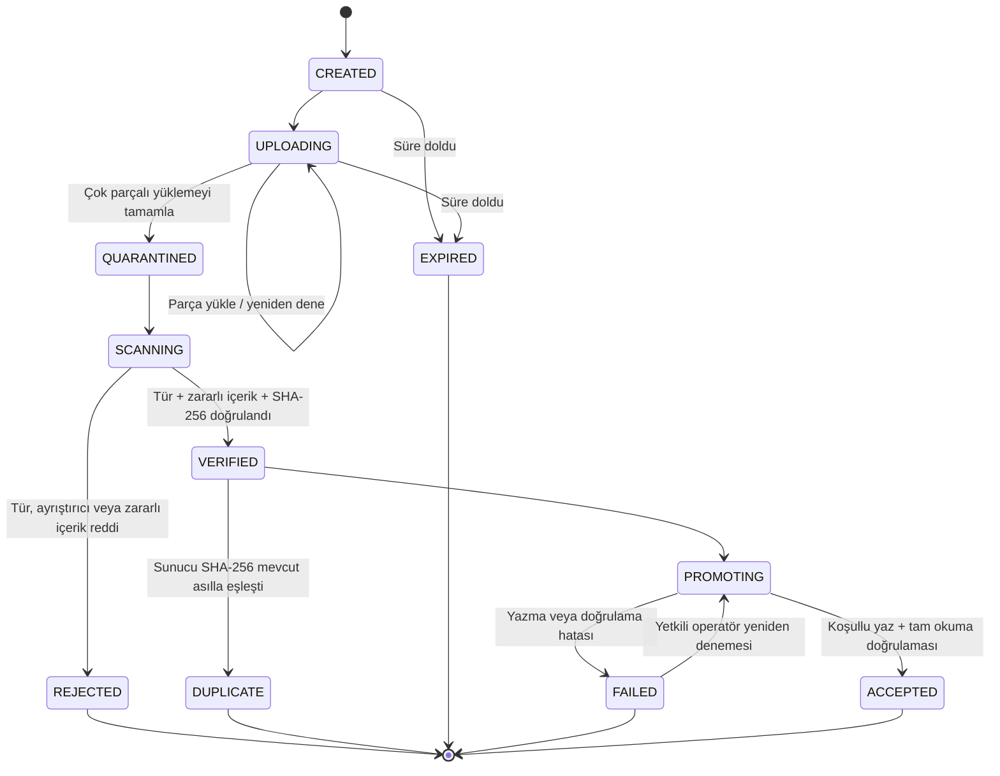
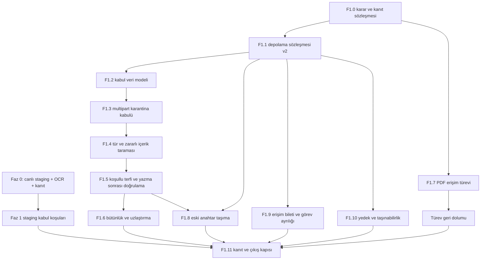

# Sivas Belediyesi Dijital Arşiv — Teslim Fazları Yol Haritası

**Belge durumu:** Uygulama iş paketi  
**Sürüm:** 1.0  
**Tarih:** 30 Temmuz 2026  
**Kapsam:** Faz 0 çıkış kapısı ve Faz 1 güvenli belge kabul hattı

## 1. Amaç

Bu belge, çalışan dikey pilotu ilk mimaride tanımlanan güvenli ve taşınabilir
arşiv omurgasına yaklaştıran teslim işlerini sıralar. Müdürlük belge profilleri,
Kent Rehberi ve diğer kurumsal entegrasyonlar bu fazın dışında tutulur; önce
ortak kabul, depolama, bütünlük ve kanıt hattı olgunlaştırılır.

Bu belge aşağıdaki kaynaklarla birlikte uygulanır:

- `ANA_SISTEM_TASARIM_BELGESI.md`
- `S3_DEPOLAMA_VE_DEGISMEZLIK_POLITIKASI.md`
- `ADR-012-NESNE-DEPOLAMA-SOYUTLAMASI.md`
- `FAZ_0_ISLETIM_REHBERI.md`
- `VERI_SOZLUGU.md`

## 2. Terimler ve mimari sınır

Bu belgede **faz**, ölçülebilir teslim kapısını ifade eder. `PROJE_PLANI.md`
içindeki ürün olgunluk adımları ise **aşama** olarak anılır. Böylece “Faz 1
kabul hattı” ile “Aşama 1 ürün kabuğu” birbirine karıştırılmaz.

Mevcut D1/R2/Vinext uygulaması dikey pilottur. Faz 1:

- Next.js/Vinext'i kurumsal çekirdek kararı hâline getirmez.
- Üretim API teknolojisini seçmez.
- Çalışma zamanına özgü R2/Workers kodunu kabul alanına yaymaz.
- Durum makinesini ve kabul kanıtını veritabanında, sağlayıcı işlemlerini
  adaptörde tutar.
- Aynı sözleşmelerin ileride .NET, Java veya eşdeğer kurumsal servis üzerinde
  uygulanabilmesini zorunlu kılar.

**Kural:** Çalışma zamanına ve sağlayıcıya özgü kod yalnız adaptör ve dağıtım
katmanında bulunur. Kabul durumları, hata kodları, kanıt modeli ve iş kuralları
sağlayıcıdan bağımsızdır.

## 3. Faz 0 — Gerçek kalan çıkış kapısı

Faz 0'ın geliştirme omurgasının büyük bölümü kodlanmıştır; canlı teslim ve
kanıt kapısı henüz tamamlanmamıştır. Kodlanan omurga:

- geliştirme, staging ve production ortam sözleşmesi;
- zorunlu sır listesi ve sır sızıntısı kontrolü;
- CI üzerinde typecheck, lint, build ve test;
- OCR, bakım ve bütünlük cron tetikleyicileri;
- exponential backoff ve dead-letter görünürlüğü;
- yapılandırılmış log, korelasyon kimliği ve `/api/health`;
- ADR-012 depolama soyutlaması;
- model dosyalarını içeren, ayrıcalıksız kullanıcıyla çalışan OCR imajı.

İki sınır açıkça bilinmelidir:

- Backoff süresi veritabanı kolonu değildir; `app/api/jobs/process/route.ts`
  içinde hesaplanır. Zamanlama alanları `next_attempt_at`, `last_attempt_at` ve
  `dead_lettered_at` kolonlarında tutulur.
- CI workflow'u bugün yalnız doğrulama yapar. Dağıtım, `deploy:verify`
  koşusu ve başarısızlıkta rollback adımları workflow'a bağlı değildir;
  `scripts/verify-deployment.mjs` betiğinin mevcut olması CI/CD hattının
  tamamlandığını tek başına göstermez.

`vite.config.ts` içindeki yer tutucu veritabanı kimliği yalnız yerel
Miniflare/Vite çalışması içindir. Gerçek D1/R2 kaynakları Sites kontrol düzlemi
veya seçilen dağıtım platformu tarafından bağlanır; bu değer üretim kaynağı
olarak değiştirilmez.

Faz 0 aşağıdaki dört kanıt tamamlanmadan kapanmış sayılmaz:

1. OCR servisi kurum içi veya özel konteyner ortamında TLS ve servis kimliğiyle
   barındırılır.
2. Staging uygulaması gerçek çalışma zamanı değerleriyle canlı dağıtılır;
   şema göçü ve readiness denetimi geçer.
3. Dağıtım, `deploy:verify` doğrulaması ve başarısızlıkta rollback adımları
   CI/CD workflow'una bağlanır ve en az bir gerçek koşuda çalıştığı gösterilir.
4. Gerçek bir pilot belge kullanıcı tarafından yüklenir, cron tarafından
   otomatik OCR'a alınır, doğrulama kuyruğuna düşer ve arşivlenir. Belge
   kimliği, iş kimliği, model sürümü, korelasyon kimliği, şema sürümü ve
   denetim olayı kanıt paketine girer.

Faz 1 geliştirmesi Faz 0'ın kalan altyapı işleriyle paralel ilerleyebilir; ancak
Faz 1 staging kabul koşuları başlamadan Faz 0 çıkış kapısı kapanmalıdır.

## 4. Faz 1 — Kabul hattı sağlamlaştırma

### 4.1 Amaç

Güvenilmeyen dosyanın kabul API'sine gelişinden, doğrulanmış ve değiştirilemez
asıl nesne olarak arşivlenmesine kadar tüm hattı; büyük dosya, kesinti, zararlı
içerik, yanlış tür, eşzamanlı yazma, kısmi hata ve sağlayıcı değişimi
senaryolarında güvenli hâle getirmektir.

### 4.2 Kapsam dışı

- Müdürlük belge türlerinin ayrıntılı envanteri
- Kent Rehberi, EBYS, KEP ve e-imza entegrasyonları
- Öğrenen tasnif ve aktif öğrenme
- Nihai üretim API programlama dili seçimi
- Kurumsal saklama sürelerinin hukuk/arşiv birimleri adına belirlenmesi

### 4.3 Çıkış ölçütü

Faz 1 yalnız aşağıdakilerin tamamı kanıtla geçtiğinde kapanır:

1. `S3_DEPOLAMA_VE_DEGISMEZLIK_POLITIKASI.md` §19 içindeki 12 kabul testi:
   **12/12 sonuçlandırılmış**, uygulanabilir testlerin tamamı geçmiş ve yalnız
   yetkili ADR ile uygulanamaz sayılan testler `NOT_APPLICABLE`.
2. Bu belgede tanımlanan yedi kabul hattı güvenlik testi: **7/7**.
3. Faz 0 staging uçtan uca teslim kanıtı: **geçti**.
4. Kritik veya yüksek seviyeli açık güvenlik/bütünlük bulgusu: **0**.
5. Kanıt paketindeki her sonuç; commit, ortam, sağlayıcı adaptörü, zaman,
   korelasyon kimliği ve test koşusuyla ilişkilidir.

Kodda bir fonksiyonun veya ifadenin bulunması kabul kanıtı değildir. Sağlayıcı
sözleşmesi, yetki reddi, kesinti, geri yükleme ve taşınabilirlik testleri çalışan
ortamda yürütülür.

## 5. Hedef kabul akışı

Kurallar:

- OCR işi yalnız `ACCEPTED` durumundan sonra oluşturulur.
- Kullanıcı ve görüntüleme servisi `temporary` veya `quarantine` nesnesini
  okuyamaz.
- İstemcinin bildirdiği MIME türü yalnız ipucudur; karar değildir.
- İstemcinin önceden bildirdiği SHA-256 yalnız erken uyarıdır; mükerrer içerik
  kararı sunucu tarafından hesaplanan SHA ile verilir ve veritabanındaki
  benzersiz indeks son güvenlik kapısı olarak korunur.
- Mükerrer içerik `VERIFIED` sonrasında ayrı `DUPLICATE` terminal durumuyla
  sonlandırılır; yeni belge, asıl nesne veya OCR işi oluşturulmaz. Kullanıcı
  mevcut belgeye yetkiliyse kimliği gösterilir, değilse yalnız genel mükerrer
  içerik yanıtı verilir.
- Asıl anahtar daha önce varsa terfi başarısız olur.
- `FAILED` kullanıcı için terminaldir; kullanıcı eylemiyle yeniden açılmaz.
  Karantina nesnesi ve `VERIFIED` alındısı hâlâ geçerliyken yalnız yetkili
  operatör komutu, gerekçe ve denetim olayıyla `PROMOTING`'e yeniden alınabilir;
  pencere karantina saklama süresiyle sınırlıdır, dolunca yeni oturum gerekir.
- Asıl yazıldıktan sonra uygulama rolü onu silerek geri alma yapmaz.
- Son veritabanı adımı başarısız olursa nesne sahipsiz olarak raporlanır ve
  yalnız yetkili uzlaştırma süreci karar verir.
- Her durum geçişi idempotency anahtarı ve denetim olayıyla ilişkilidir.

## 6. İş paketleri ve bağımlılıklar

### F1.0 — Karar ve kanıt sözleşmesi

**Amaç:** Uygulamaya başlamadan kabul sonucunun nasıl ölçüleceğini ve açık
altyapı kararlarını sabitlemek.

**Durum:** Karar belgeleri 30 Temmuz 2026 tarihinde oluşturuldu. Kurumsal saklama
süreleri, üretim sağlayıcısı ve KMS sahipliği ilgili kurum sahiplerinin üretim
onayı olmadan teknik ekip tarafından belirlenmez.

**Teknik olarak sabitlenen kararlar:**

- `ADR-013-KABUL-DURUM-MAKINESI.md`: kabul durumları, idempotency, sabit hata
  kodları, `DUPLICATE` ve çalışma zamanı bağımsızlığı
- `ADR-014-KARANTINA-VE-ZARARLI-ICERIK.md`: dört fiziksel yetki alanı, ClamAV
  başlangıç motoru, fail-closed tarama ve 2 GiB/16 MiB multipart pilot profili
- `ADR-015-PDF-ERISIM-TUREVI.md`: izole PDFium renderer, 150 DPI raster erişim
  PDF'si, sınırlar ve 60 saniyelik tek kullanımlık bilet değişimi
- `ADR-016-ASIL-NESNE-DEGISMEZLIK.md`: üretim asıl kasasında sürümleme,
  compliance mode Object Lock/eşdeğer WORM ve legal hold zorunluluğu; R2 bucket
  lock'ın yalnız pilot telafi kontrolü sayılması
- `ADR-017-YEDEK-VE-TASINABILIRLIK.md`: veri sınıfına göre pilot RPO/RTO,
  ikinci hata alanı, geri yükleme ve sağlayıcı taşınabilirlik tatbikatı
- Mükerrer içerik politikası: `DUPLICATE` terminal durumu, yetki kontrollü
  mevcut belge bağlantısı ve yetkisiz kapsamda bilgi sızdırmayan genel yanıt
- Karantina–asıl yetki topolojisi: ayrı kova/namespace, ayrı Worker/servis
  kimliği ve kova+işlem kapsamıyla sınırlandırılmış S3 kimlik bilgileri birlikte
  uygulanır; TypeScript arayüzünden metot kaldırmak tek başına depolama yetkisi
  ayrımı sayılmaz
- Ayrıntılı test, veri, kanıt ve sorumluluk sözleşmesi:
  `FAZ_1_KANIT_REHBERI.md`

**Kabul ölçütleri:**

- Her §19 testi için ön koşul, test verisi, beklenen sonuç, kanıt türü, yürüten
  ve onaylayan `FAZ_1_KANIT_REHBERI.md` içinde tanımlıdır.
- R2 pilotunda Object Lock/legal hold bölümü ADR-016 ile `NOT_APPLICABLE`
  sayılır ve bucket lock telafi testi geçer; üretim sağlayıcısında Test 7'nin
  tamamı geçmeden üretim açılmaz.
- Kanıt paketinde gerçek belge içeriği, kişisel veri, erişim anahtarı veya sır
  bulunmaz.

### F1.1 — Depolama sözleşmesi v2 ve görev ayrılığı

**Amaç:** ADR-012'yi büyük dosya, değişmezlik ve sağlayıcı taşınabilirliği için
genişletmek.

**Durum:** Rol sözleşmeleri, R2 adaptörleri, akışlı hasher, S3 anlamsallıklı bellek
test adaptörü ve R2 hata/koşul testleri 30 Temmuz 2026 tarihinde uygulandı. Gerçek
R2 ve ikinci S3 uyumlu sağlayıcı kanıtı F1.11 staging kapısında üretilecektir.
Eski geniş `ObjectStorage` yalnız F1.3–F1.5 geçişi tamamlanana kadar uyumluluk
katmanı olarak kalır; yeni kod dar rol sözleşmelerini kullanır.

Tek geniş `ObjectStorage` rolü yerine yetenekleri ayrılmış sözleşmeler
tanımlanır:

- `ObjectReader`: akışlı `get`, `head` ve aralıklı okuma
- `StagingStorage`: multipart başlat/sürdür/parça yükle/tamamla/iptal et,
  listele ve geçici nesne sil
- `ImmutableVaultWriter`: yalnız koşullu `putIfAbsent` veya koşullu `promote`
- `StorageInventory`: sayfalı liste ve sağlayıcı sürüm/checksum bilgisi
- `DispositionStorage`: normal uygulama kimliğinde bulunmayan, kurul/onay
  sürecine bağlı ayrı tasfiye yetkisi
- `StreamingHasher`: akışlı SHA-256 için ayrı çalışma zamanı sözleşmesi.
  Cloudflare uygulaması `crypto.DigestStream` kullanır; bu yetenek depolama
  adaptörüne değil çalışma zamanı katmanına aittir ve taşınabilir tasarımda
  sözleşmenin arkasında tutulur.

Checksum sınırı: tek parça `put` çağrısı sağlayıcıya SHA-256 verebilir; multipart
tamamlama aynı alanı sunmaz ve sağlayıcı checksum'ı bileşik (composite) olabilir.
Uçtan uca içerik SHA'sı her durumda uygulamanın akışlı hesabıyla üretilir;
adaptör yalnız verilen checksum'ı iletir ve sağlayıcı sonucunu döndürür.

Mevcut akışlı `get` davranışı korunur. Sağlayıcı sürümü, ETag ve checksum sonucu
genel dönüş tiplerine eklenir. R2'ye özgü `uploadId`, koşul ve hata tipleri
adaptörün dışında görünmez; sağlayıcı belirteçleri veri modelinde opak tutulur.

**Kabul ölçütleri:**

- Aynı anahtara ikinci koşullu yazma sözleşme testinde reddedilir.
- Asıl kasa sözleşmesinde `delete` metodu yoktur.
- Uygulama rotalarında doğrudan `R2Bucket` çağrısı yoktur.
- R2 ve en az bir S3 uyumlu test adaptörü aynı sözleşme paketini geçer.
- Akışlı SHA hesabı depolama adaptöründen bağımsız sözleşme testini geçer;
  multipart yüklemede içerik SHA kararı sağlayıcı checksum'ına dayanmaz.
- Eski anahtar taşıma işi, hem koşullu yazma hem `copy/promote` yeteneğine
  bağımlıdır; bu iki yetenek olmadan çalışmaz.

### F1.2 — Kabul veri modeli ve şema göçü

**Amaç:** Kesinti sonrası devam edebilen, her adımı kanıtlanabilir kabul
durumunu veritabanında tutmak.

Yeni tablolar:

| Tablo | Amaç |
|---|---|
| `upload_sessions` | Kullanıcı, müdürlük, idempotency anahtarı, durum, beklenen boyut, bildirilen/algılanan tür, `duplicate_of_document_id` ve zaman aşımı |
| `upload_parts` | Parça numarası, boyut, checksum, ETag ve tekrar yükleme durumu |
| `ingest_objects` | Kabul öncesi `temporary`/`quarantine` nesnelerinin yetkili envanteri |
| `ingest_receipts` | SHA-256, tarayıcı motor/sürüm/imza, tür doğrulaması, kasa sürümü, doğrulama zamanı ve sonuç |
| `upload_session_events` | Ardışık durum sürümü, aktör, gerekçe, kanıt alındısı ve değiştirilemez olay özeti |
| `integrity_runs` | Tam tarama koşusu, kapsam, başlangıç/bitiş ve özet |
| `integrity_findings` | Nesne bazlı kalıcı bütünlük bulgusu ve çözüm durumu |
| `reconciliation_runs` | Depo–veritabanı uzlaştırma koşusu ve sayısal sonuç |
| `reconciliation_findings` | Sahipsiz nesne/dosyasız kayıt ve yetkili karar |
| `access_tickets` | Özetlenmiş bilet, kapsam, amaç, son kullanma ve tüketilme zamanı |

`ingest_objects`, kabul öncesindeki nesnelerin tek doğruluk kaynağıdır.
`binary_objects` yalnız kabul edilmiş asıl ve türev nesnelerin yetkili
envanteri olarak kalır. Terfi sırasında iki kayıt aynı kabul oturumu ve denetim
olayıyla bağlanır.

`archive_documents.storage_key` genişlet–taşı–daralt göçüyle kaldırılır. Sorun
doğrudan bir NOT NULL çakışması değil, `binary_objects` yetkili kaynak ilan
edilmişken kolonun ve fallback okumasının yaşamaya devam etmesiyle oluşan çift
doğruluk kaynağıdır:

1. Bütün okumalar `binary_objects` üzerine geçirilir.
2. Eski kayıtlar doğrulanır.
3. Fallback okuması kaldırılır.
4. En az bir geriye uyumlu sürümden sonra kolon ve fallback kodu şema göçüyle
   kaldırılır.
5. İçerik mükerrerliği için `original` sınıfında SHA-256 benzersizliği
   `binary_objects` üzerindeki kısmi benzersiz indekse taşınır; yarış durumunda
   bu indeks son güvenlik kapısıdır.

**Kabul ölçütleri:**

- Durum geçişleri izinli geçiş listesi dışında güncellenemez.
- Aynı idempotency anahtarı ikinci belge veya ikinci asıl üretmez.
- `FAILED` → `PROMOTING` yalnız geçerli karantina/`VERIFIED` alındısı, yetkili
  operatör, gerekçe ve denetim olayıyla yapılır; kullanıcı bu geçişi başlatamaz.
- Aynı sunucu SHA-256 değerine sahip ikinci oturum `DUPLICATE` olur; yeni belge,
  asıl nesne veya OCR işi üretmez.
- Şema, `lib/archive-schema.ts` ve `db/schema.ts` içinde aynı anda güncellenir.
- Göç testi taze veritabanı, mevcut sürümden yükseltme, yarıda kalma ve yeniden
  çalıştırma senaryolarını geçer.
- Depolama anahtarı için çift doğruluk kaynağı kalmaz; `storage_key` fallback
  okuması üretim yolunda bulunmaz.

**Uygulama durumu (F1.2):** Şema sürüm 8'e çıkarıldı; kabul oturumu, parça,
nesne, alındı, değiştirilemez durum olayı, bütünlük/uzlaştırma ve erişim bileti
tabloları hem yetkili DDL'de hem Drizzle aynasında tanımlandı. İzinli geçişler,
`state_version`, olay zorunluluğu, operatör yeniden deneme kanıtı, idempotency ve
asıl SHA-256 tekilliği D1 kısıt/tetikleyicileriyle korunuyor. Taze kurulum,
yükseltme, yarıda kalma ve tekrar çalıştırma testleri vardır. Bütün nesne okumaları
`binary_objects` üzerinden yapılır; `storage_key` yalnız geriye uyumlu yazma/kabul
alındısı olarak bir sürüm daha tutulur ve daraltma göçünde fiziksel olarak kaldırılır.
F1.3–F1.5 çalışma zamanı akışı bu sözleşmeyi kullanır.

### F1.3 — Çok parçalı ve yeniden başlatılabilir karantina yüklemesi

**Amaç:** Büyük tarama dosyalarını uygulama belleğinde bütün olarak tutmadan
almak ve kesinti sonrası devam ettirmek.

API akışı:

1. Yükleme oturumu oluştur.
2. Yetkilendirilmiş parçayı `temporary` alana aktar.
3. Parça ETag/checksum sonucunu kaydet.
4. Eksik parçaları sorgula ve yüklemeyi sürdür.
5. Tamamlanan nesneyi `quarantine` durumuna geçir.
6. Süresi dolan veya iptal edilen yüklemeyi yaşam döngüsü işiyle temizle.

Pilot profili ADR-014 gereği azami 2 GiB belge, 32 MiB multipart eşiği, son parça
hariç 16 MiB parça, istemci başına dört eşzamanlı parça ve 24 saatlik oturumdur.
Profil değişikliği büyük dosya, tarama ve bellek kabul testlerinin yeniden
koşulmasını gerektirir.

Bellek disiplini yalnız yükleme yönünü değil OCR aktarımını da kapsar. Bugün
Worker nesneyi `app/api/jobs/process/route.ts` içinde `object.arrayBuffer()` ile
belleğe alıyor ve OCR servisi `services/ocr/app/main.py` içinde dosyanın
tamamını ikinci kez okuyor. Hedef tasarımda OCR servisine belge baytları Worker
üzerinden taşınmaz; servis yalnız nesne kimliği alır ve aslı ayrı, salt-okunur
servis kimliğiyle akışla okur.

**Kabul ölçütleri:**

- API `request.formData()` ve `file.arrayBuffer()` ile tam dosya tamponlamaz.
- Worker, OCR aktarımında nesne gövdesini belleğe almaz; OCR servisi belgeyi
  nesne referansıyla, salt-okunur kimlikle ve akışla okur.
- Yükleme, süreç yeniden başladıktan sonra eksik parçadan devam eder.
- Aynı parça güvenli biçimde yeniden gönderilebilir; çelişen checksum
  reddedilir.
- Boyut sınırı hem oturum başında hem tamamlanan nesne başlığında doğrulanır.
- Yarım yüklemeler belirlenen süre sonunda raporlanır ve yalnız geçici alandan
  temizlenir.
**Uygulama durumu (F1.3):** Oturum oluşturma/durum sorgulama, akışlı parça
yükleme, eksik parçadan devam, sunucu tarafı parça SHA-256 doğrulaması, dört
aktif parça sınırı, idempotent tamamlama ve ayrı `TEMPORARY_FILES` →
`QUARANTINE_FILES` akışlı aktarım servis/HTTP katmanında uygulandı. 24 saatlik
iş, yalnız tamamlanmamış geçici nesneyi temizleyip oturumu `EXPIRED` bırakır.
OCR tüketicisi belge baytını Worker üzerinden taşımak yerine asıl nesne
referansını gönderir; OCR servisi sabit kovadan salt-okunur kimlikle 8 MiB
parçalarla indirip boyut/SHA-256 değerini doğrular. Arayüz yeni kabul API'sine
taşındı ve eski doğrudan-asıl HTTP POST yolu kapatıldı. Kod kabul ölçütleri
tamamdır; gerçek ayrı kova bağları ve 2 GiB bellek gözlemi F1.11 staging kanıtıdır.

### F1.4 — Magic-byte, ayrıştırıcı ve zararlı içerik taraması

**Amaç:** İstemci MIME beyanına güvenmeden dosya türünü doğrulamak ve kabul
edilmemiş içeriği izole tutmak.

Kontroller:

- İstemci türü, dosya uzantısı, magic-byte sonucu ve güvenli ayrıştırıcı sonucu
  birlikte değerlendirilir.
- PDF, JPEG, PNG ve TIFF için izinli imza ve ayrıştırma profili uygulanır.
- Bozuk, çok biçimli veya tanınmayan içerik reddedilir.
- Zararlı içerik taraması izole servis rolüyle tüm nesne üzerinde çalışır.
- Tarayıcı motoru, sürümü, imza/veritabanı sürümü ve sonuç kabul alındısına
  yazılır.
- Tarama denemelerinin her biri ayrı, değiştirilemez `ingest_receipts` satırıdır;
  hata geçmişi korunur ve oturum başına yalnız bir `VERIFIED` alındı bulunabilir.
- Testte güvenli EICAR örneği kullanılır; gerçek zararlı yazılım saklanmaz.

**Kabul ölçütleri:**

- `application/pdf` beyan edilen yürütülebilir içerik reddedilir.
- Zararlı veya taranamayan içerik `original` alana geçmez.
- Tarama servisi kullanılamıyorsa sistem açık geçmez; oturum karantinada kalır.
- Karantina nesnesi normal görüntüleme/indirme rolüyle okunamaz.
- OCR yalnız tarama ve tür doğrulaması tamamlandıktan sonra kuyruğa alınır.

**Uygulama durumu (F1.4):** `services/content-scan` sabit karantina kovasından
salt-okunur kimlikle akışlı indirme, tam boyut/SHA-256 kontrolü, PDF/JPEG/PNG/TIFF
magic-byte ve uzantı eşleştirmesi, qpdf/Pillow güvenli ayrıştırması ve ClamAV tam
nesne taraması uygular. İmza yaşı 24 saati geçerse fail-closed davranır. Kiralı
`content_scan_jobs` kuyruğu exponential backoff/dead-letter görünürlüğü sağlar;
her deneme değiştirilemez alındıdır ve yalnız dört kontrol birlikte geçerse
`VERIFIED` olur. Kod kabul ölçütleri tamamdır; EICAR ve gerçek imza güncelleme
kanıtı F1.11 staging koşusuna bağlıdır.
### F1.5 — Koşullu terfi ve yazma sonrası doğrulama

**Amaç:** Doğrulanmış karantina nesnesini değişmez asıl kasaya güvenli biçimde
almak.

Akış:

1. Belge ve asıl nesne kimliği rezerve edilir.
2. Karantina nesnesi benzersiz asıl anahtarına `if-absent` koşuluyla terfi eder.
3. Sağlayıcı boyut, sürüm, ETag ve checksum sonucu alınır.
4. Asıl nesne yeniden akışla okunur ve SHA-256 tekrar hesaplanır.
5. Boyut ve SHA eşleşirse `archive_documents`, `binary_objects`, kabul alındısı,
   denetim olayı ve OCR işi tek sonlandırma adımında yazılır.
6. Sonlandırma başarısızsa asıl silinmez; uzlaştırma işi sahipsiz nesneyi bulur.

**Kabul ölçütleri:**

- Aynı hedef anahtara ikinci terfi depolama katmanında başarısız olur.
- Kabul alındısındaki SHA, karantina SHA'sı, asıl tam okuma SHA'sı ve veritabanı
  SHA'sı aynıdır.
- Uygulamanın normal servis rolü kabul edilmiş aslı silemez.
- `documents/route.ts` içindeki asıl nesneyi geri alma amacıyla yapılan
  `objectStorage.delete(storageKey)` davranışı kaldırılmıştır; yalnız geçici veya
  karantina nesnesi ayrı rol tarafından temizlenebilir.
- Sağlayıcı sürümü ve şifreleme durumu `binary_objects` kaydına yazılır.

**Uygulama durumu (2026-07-30):** Kod kapısı tamamlandı. Şema v14 ile kiralı,
geri çekilmeli ve dead-letter görünür `promotion_jobs` kuyruğu ile değiştirilemez
`promotion_receipts` kanıtı eklendi. Terfi yalnız `ImmutableVaultWriter.promote`
üzerinden `if-absent` koşuluyla yapılır; yanıt kaybı sonrasında dolu hedefin
üzerine yazılmaz, mevcut hedef tam okunarak güvenli biçimde kurtarılır. Asıl
nesne boyutu ve SHA-256 değeri tam akışlı yeniden okumayla doğrulanmadan belge,
`binary_objects`, OCR işi ve iki denetim zinciri oluşturulmaz. D1 sonlandırması
kira belirteciyle çitlenmiş tek batch'tir; sonlandırma hatasında asıl silinmez.
Birim testleri başarılı yazma, yazma sonrası yanıt kaybı, bozuk asıl ve mükerrer
SHA yarışını kapsar. Gerçek R2 üzerinde T-01/T-02 ve kontrollü sonlandırma hatası
kanıtları F1.11 staging koşusunda hâlâ zorunludur.

### F1.6 — Kalıcı bütünlük taraması, alarm ve uzlaştırma

**Amaç:** Metadata karşılaştırmasını gerçek dosya bütünlüğü denetimine
dönüştürmek ve bulguların sonraki dilimlerde kaybolmasını engellemek.

İki tarama profili bulunur:

- **Hızlı tarama:** varlık, boyut, sürüm ve sağlayıcı checksum/metadata
  karşılaştırması.
- **Tam tarama:** nesneyi akışla okur, SHA-256 hesaplar ve yetkili kayıtla
  karşılaştırır.

Her koşu `integrity_runs`, her sorun `integrity_findings` kaydı üretir.
`maintenance_tasks.last_error` yalnız son çalışma durumu için kullanılabilir;
bulgu kaynağı değildir.

Uzlaştırma üç yönde çalışır:

- Depoda var, yetkili veritabanı kaydı yok: sahipsiz nesne.
- Veritabanı kaydı var, depoda nesne yok: dosyasız kayıt.
- Belge alındısı var, yetkili asıl `binary_objects` kaydı yok: eksik kayıt.

**Kabul ölçütleri:**

- Boyutu ve custom metadata değeri değiştirilmeden oluşturulan kontrollü SHA
  uyuşmazlığı tam taramada yakalanır.
- Bir dilimde bulunan bulgu sonraki temiz dilimde silinmez.
- Bulgu kalıcı alarm/olay kaydı üretir ve çözümlenmeden kapanmaz.
- Uzlaştırma sayfalı, kaldığı yerden devam eden ve yaş toleranslıdır.
- Uzlaştırma kendiliğinden asıl nesne silmez veya veritabanı kaydını düşürmez.
- Koşu kapsamı sabit su işaretlidir; süresi dolmuş iş kirası fencing belirteciyle
  devralınır ve eski Worker yeni ilerlemeyi ezemez.
- Koşu kapsamı, süre, taranan nesne sayısı ve sonuç raporlanır.

**Uygulama durumu (F1.6):** Şema v16 ile bütünlük koşuları hızlı/tam profil,
sabit `rowid` su işareti ve fencing belirteçli iş kirası kazandı. Hızlı profil
Hızlı profil varlık, boyut, sağlayıcı checksum'ı ve custom metadata SHA'sını;
tam profil nesneyi akışla okuyup SHA-256'yı yetkili kayıtla
karşılaştırır; koşular profiller arasında sırayla döner. Her koşu
`integrity_runs`, her sorun kalıcı `integrity_findings` kaydı ve bulgu kimliğiyle
korelasyonlu alarm sinyali üretir; aynı nesne/tür için çözülmemiş bulgu yinelenmez,
fakat koşu özeti yeniden gözlenen ihlali sayar. `lib/reconciliation.ts` üç yönlü,
sayfalı ve kaldığı yerden devam
eden uzlaştırmayı çalıştırır: sahipsiz nesne, dosyasız kayıt ve eksik asıl kayıt
bulguları sağlayıcının yükleme zamanına dayalı yaş toleransı ile terfi penceresini
tanır; hiçbir nesne silinmez, hiçbir kayıt düşürülmez ve nesne anahtarları loglara
yazılmaz. Sonuçlar `INTEGRITY_CRON` diliminde koşar ve genel bakış
uç noktasında `integrityFindings`/`reconciliation` alanlarıyla raporlanır.
Sürüm kayması bulgu taksonomisine girmez; uyarı olayı üretir ve tam profil
içerik SHA'sını ayrıca doğrular. Gerçek R2 kaynağıyla T-08/T-12 kanıtları
F1.11 staging koşusuna aittir.

**İşletim kapasite kapısı:** Mevcut `17 */6 * * *` periyodu ve tam profil başına
en çok beş nesneyle teorik tam tur süresi `ceil(nesne_sayısı / 5) × 6 saat`tir;
dosya boyutu ve yeniden denemeler bu süreyi uzatır. Üretim öncesinde envanter
büyüklüğüne göre hedef tam tur süresi, cron/queue paralelliği ve en büyük 2 GB
nesnenin süre ölçümü sayısal olarak kararlaştırılmalıdır.

### F1.7 — PDF erişim türevi ve geri dolum

**Amaç:** Görüntüleme yetkisinde asıl PDF'yi sunma zorunluluğunu kaldırmak.

ADR-015 aşağıdaki kararları kesinleştirmiştir:

- renderer/sanitizer, Worker dışında izole, sürümü ve imaj özeti sabitlenmiş
  PDFium tabanlı `services/document-render` servisidir;
- aktif içerik, ek dosya ve betikler erişim türevine taşınmaz;
- sayfalar 150 DPI raster olarak yeniden çizilir ve web görüntülemeye uygun
  doğrusallaştırılmış (linearized) erişim PDF'sinde birleştirilir;
- 512 MiB türev sınırını tek bölümde aşacak belgeler sayfa aralıklı birden çok
  erişim bölümü olarak üretilir; her bölüm `derived_from_id`, sayfa aralığı ve
  SHA-256 değeriyle ayrı `binary_objects` kaydıdır;
- bölümleme dahil hiçbir güvenli yol üretilemiyorsa iş
  `DERIVATIVE_REVIEW_REQUIRED` durumuna alınır; asıl PDF'ye görüntüleme
  fallback'i yine açılmaz;
- `access` ile uzun dönem `preservation`/PDF-A çıktısı aynı şey sayılmaz;
- renderer adı, sürümü, profil sürümü ve kaynak asıl nesne kimliği kaydedilir.

**Kabul ölçütleri:**

- PDF görüntüleme isteği hiçbir durumda `original` sınıfına düşmez.
- Türev, `derived_from_id` ve üretici sürümüyle yeni nesne olarak yazılır.
- Asıl nesnenin sürümü, SHA'sı ve anahtarı değişmez.
- 512 MiB'ı aşan kontrollü test belgesi sayfa aralıklı bölümlerle
  görüntülenebilir kalır; yalnız boyut nedeniyle görüntülenemeyen belge oluşmaz.
- Türev işi durumları (`DERIVATIVE_REVIEW_REQUIRED` dahil) türev sözleşmesinde
  tanımlıdır; kabul durum makinesine karışmaz ve işletim metriği olarak izlenir.
- Mevcut belgeler için kaldığı yerden devam eden, idempotent geri dolum işi
  bütün eksik türevleri üretir.
- Başarısız türevler retry/dead-letter görünürlüğüne sahiptir.

**Uygulama durumu (F1.7):** Şema v18 ile `derivative_jobs` kuyruğu (kiralı
claim, exponential backoff, `REVIEW_REQUIRED` ve dead-letter görünürlüğü),
renderer/imaj/sayfa kanıtları ve `binary_objects.derivative_generation_id`
eklendi. Belge+profil tekilliği yeni profil sürümünün eski türevi ezmeden ayrı
kuşak üretmesine izin verir. Worker'ın verdiği kararlı iş kimliği fiziksel nesne
anahtarında kullanılır; yanıt kaybında koşullu yazma var olan segment başlığını
doğrulayarak sürer. Worker beklenen renderer, profil, registry imaj özeti,
anahtar deseni, MIME, boyut, bitişik sayfa aralığı ve tam SHA-256 kanıtlarının
tamamını doğrulamadan kuşağı etkinleştirmez. Segmentler `DERIVATIVE_FILES`
rolünde tutulur; bütünlük ve uzlaştırma işleri namespace'e göre doğru okuyucuyu
seçer. Sonlandırma kayıtları, denetim olayı ve tamamlanmış kuşak kanıtı tek
kira-çitli batch'tir. PDF görüntüleme yalnız tamamlanmış/eksiksiz kuşağı sunar;
aksi durumda 425 döner ve asıl PDF'ye fallback açılmaz. Gerçek PDFium/pikepdf
imaj koşusu, ayrı depo kimlikleri ve T-03 kanıtı staging'e (F1.11) aittir;
onaylı OCR metin katmanlı ikinci profil sonraki dilimdedir.

### F1.8 — Eski nesne anahtarlarının yetkili taşınması

**Amaç:** Anahtar veya custom metadata içinde kişisel veri taşıma ihtimali olan
politika öncesi nesneleri güvenli anahtara almak.

`storage.legacyKeys` sayısı yalnız `LIKE '%.%'` göstergesidir; doğrulanmış kişisel
veri vakası değildir. Önce maskelenmiş envanter çıkarılır:

- anahtar biçimi;
- custom metadata alan adları ve veri sınıflandırma sonucu;
- bağlı belge/nesne kimliği;
- kaynak ve hedef SHA-256;
- taşıma ve doğrulama durumu.

Taşıma:

1. Güvenli hedef anahtar üret.
2. Hedefin bulunmadığı koşuluyla kopyala/terfi ettir.
3. Hedefi tam okuyup SHA-256 doğrula.
4. `binary_objects.object_key` referansını atomik değiştir; kaldırılmış
   `archive_documents.storage_key` alanına yeniden çift yazma ekleme.
5. Denetim ve taşıma alındısı yaz.
6. Eski nesneyi geri dönüş süresi boyunca erişime kapalı tut.
7. Silme gerekiyorsa normal uygulama rolüyle değil, ayrı yetkili tasfiye
   prosedürüyle gerçekleştir.

**Bağımlılık:** F1.1 içindeki hem koşullu yazma hem `copy/promote`, F1.5 içindeki
tam doğrulama tamamlanmadan bu iş çalıştırılmaz.

**Kabul ölçütleri:**

- Hedef anahtar varsa üzerine yazılmaz.
- Taşıma öncesi ve sonrası SHA aynıdır.
- Kullanıcı isteği taşıma sırasında eski aslı veya yanlış nesneyi sunmaz.
- Anahtar ve custom metadata taramasında doğrulanmış kişisel veri kalmaz.
- Loglarda özgün dosya adı, açık adres, kişi adı veya erişim belirteci bulunmaz.

**Uygulama durumu (F1.8):** Şema v20 ile `legacy_key_migrations` maskeli
envanter/taşıma tablosuna kaynak bekleme sonu ve ayrı tasfiye kanıtı eklendi.
`lib/key-classification.ts` anahtarları yapısal olarak sınıflandırır; yalnız
rakamdan oluşan kimlikleri opak token kabul etmez ve Unicode-güvenli maskeleme
uygular. Envanter hem anahtar biçimini hem custom metadata alan/değerlerini
bellekte inceler; ham değerleri saklamak yerine sabit bulgu kodları ve maskeli
alan biçimleri üretir. Anahtarı güvenli olup metadata'sı bulgulu nesne de yeniden
paketlenir.

Hedef anahtarlar eski belge/nesne kimliklerinden türetilmez; iki yeni UUIDv4
ile oluşturulur. Kaynak if-absent `promote` ile doğru ad alanındaki hedefe
kopyalanır. Hedefin tam SHA-256 ve boyutuna ek olarak MIME türü ve yalnız
`sha256` + `objectClass` içeren temiz metadata sözleşmesi doğrulanır;
`binary_objects.object_key` referansı denetim olayıyla tek kira-çitli batch'te
değiştirilir. ARCHIVE ve DERIVATIVE işleri ayrı dar rollerle round-robin
tüketilir. Dolu hedef ezilmez; ancak aynı baytların yanında tür ve temiz metadata
kanıtı da eşleşirse yanıt kaybı kurtarması kabul edilir.

Eski nesne normal uygulama rolüyle silinmez. Başarılı taşıma 30 günlük varsayılan
bekleme sonunu `source_retire_after` alanına yazar; süresi dolanlar genel bakışta
`readyForDisposition`, bekleyenler `retainedSources` olarak görünür. Fiziksel
silme ve `source_disposed_at` kanıtı ADR-016 kapsamındaki ayrı, dört-göz yetkili
tasfiye prosedürüne aittir. Genel bakıştaki iş sayıları müdürlük kapsamıyla
süzülür; bütün arşiv envanter ilerlemesi yalnız `*` kapsamındaki yöneticiye
gösterilir. Gerçek eski anahtar seti, ayrı tasfiye rolü ve T-11 canlı kanıtı
staging koşusuna (F1.11) aittir.

### F1.9 — Görüntüleme bileti ve depolama görev ayrılığı

**Amaç:** Görüntüleme/indirme erişimini kısa ömürlü, amaç bağlı ve denetlenebilir
hâle getirmek; tek servis kimliğinin bütün nesne sınıflarında tam yetkili
olmasını engellemek.

Roller en az şu yeteneklere ayrılır:

- kabul/geçici yazma;
- karantina tarama;
- asıl kasaya koşullu yazma;
- erişim türevi okuma;
- yetkili asıl indirme;
- bütünlük/koruma okuma;
- yedekleme;
- kurul/onay kontrollü tasfiye.

Bilet veritabanında açık değerle tutulmaz; özeti saklanır. Belge, nesne sınıfı,
kullanıcı, amaç, müdürlük kapsamı, son kullanma ve gerekiyorsa tek kullanım
bilgisiyle sınırlandırılır.

ADR-015 uyarınca görüntüleme değişim bileti 60 saniye ve tek kullanımlıdır.
Başarılı değişim, range istekleri için 15 dakika boşta kalma ve 30 dakika mutlak
süreli kullanıcı+belge kapsamlı oturum üretir. Açık indirme bileti ayrı yetkiyle
60 saniye ve tek kullanımlıdır.

**Kabul ölçütleri:**

- Süresi dolmuş veya tüketilmiş bilet reddedilir.
- Erişim bileti başka belge, kullanıcı veya nesne sınıfında kullanılamaz.
- Viewer asıl nesneyi okuyamaz; normal uygulama kimliği aslı silemez.
- Rol ayrımı yalnız uygulama kodunda değil depolama düzleminde doğrulanır:
  karantina ve asıl ayrı kova/namespace'te tutulur, ayrı servis kimlikleriyle
  erişilir ve S3 kimlik bilgileri kova+işlem kapsamıyla sınırlandırılır. Aynı
  servis kimliğinin iki kovaya birden bağlanması ayrım sayılmaz.
- Pilot topolojisi en az `TEMPORARY_FILES`, `QUARANTINE_FILES`,
  `ORIGINAL_FILES` ve `DERIVATIVE_FILES` yetki alanlarını kullanır. Yükleme,
  tarama, terfi, görüntüleme ve asıl indirme ayrı servis kimlikleriyle
  yürütülür; normal uygulama Worker'ı bütün bağları aynı anda alamaz.
- Kullanıcı veya tarayıcı kalıcı bucket erişim anahtarı alamaz.
- Yetki reddi ve başarılı erişim, hassas veri sızdırmadan denetim kaydına girer.

**Uygulama durumu (F1.9 — bilet bölümü):** Şema v21 ile `access_sessions`
eklendi. `lib/access-tickets.ts` ADR-015 profilini uygular: 256 bitlik opak
bilet 60 saniye geçerlidir ve tek UPDATE içinde bütün bağlama koşullarıyla
(kullanıcı, belge, kapsam, süre, tek kullanım, iptal) atomik tüketilir; VIEW
değişimi 15 dk boşta / 30 dk mutlak süreli, nesneye sabitlenmiş görüntüleme
oturumu üretir ve boşta kalma penceresi mutlak tavana kırpılır. DOWNLOAD
bileti oturum üretmeyen tek seferlik teslimdir. Veritabanı ve denetim yalnız
SHA-256 özet taşır; bütün redler tek tip yanıttır ve `document.access-denied`
olayıyla denetlenir. `/api/documents/[id]/file` artık bilet/oturum olmadan
içerik sunmaz; oturum istekleri `Range` destekler ve içerik bilet anındaki
yetkili nesneye sabitlenir. Bilet üretimi `POST /api/documents/[id]/access-ticket`
ucundadır ve arayüz görüntüleme/indirme için bu akışı kullanır. Depolama
düzlemi rol/IAM ayrımı, gerçek kova kimlik testleri (T-04/T-05/T-06) ve
kalıcı anahtar sızıntısı ağ izi denetimi staging koşusuna (F1.11) aittir.

### F1.10 — Yedek geri yükleme ve sağlayıcı taşınabilirliği

**Amaç:** Depolama sağlayıcısı veya ortam kaybında belgeyi yalnız dosya olarak
değil, arşiv bağlamıyla geri kazanabilmek.

Taşınabilir paket en az şunları içerir:

- nesne anahtarı yerine taşınabilir mantıksal kimlik;
- nesne sınıfı, boyut, medya türü ve SHA-256 manifesti;
- belge üst verisi ve profil sürümü;
- doğrulanmış adres/ada-parsel/diğer varlık ilişkileri;
- OCR ve türev bağlantıları;
- denetim zincirinin doğrulama için gereken bölümü;
- paket ve şema sürümü.

**Kabul ölçütleri:**

- Seçili belge, üst veri, ilişkiler, türevler ve denetim iziyle bağımsız geri
  yükleme alanına alınır.
- Geri yüklenen her nesnenin SHA'sı manifestle eşleşir.
- Paket başka bir S3 uyumlu test hedefine aktarılır ve uygulama adaptörüyle
  okunur.
- Kaynak sağlayıcıya özgü ETag/sürüm kimliği taşınabilir bütünlük kanıtı
  sayılmaz.
- Tatbikat RPO/RTO hedefleri ve gerçek sürelerle raporlanır.

### F1.11 — Otomatik kabul ve kanıt kapısı

**Amaç:** “Kod var” ile “politika kanıtla geçiyor” arasındaki farkı CI ve
staging kapısıyla kapatmak.

Test katmanları:

- birim testleri: durum makinesi, magic-byte, bilet, yetki ve hata eşleme;
- sözleşme testleri: koşullu yazma, multipart, liste, promote ve rol ayrımı;
- yerel entegrasyon: şema, idempotency, kesinti ve uzlaştırma;
- staging sağlayıcı testleri: gerçek nesne deposu, IAM, alarm ve zaman aşımı;
- tatbikat: geri yükleme ve sağlayıcı taşınabilirliği.

Faz 1 staging koşuları production verisi kullanmaz. Test nesneleri ayrı
namespace/bucket, ayrı servis kimlikleri ve süreli yaşam döngüsüyle tutulur.

## 7. Dosya bazında planlanan değişiklikler

| Dosya/alan | Değişiklik |
|---|---|
| `lib/object-storage.ts` | Rol bazlı sözleşmeler, koşullu yazma, multipart, liste, promote/copy, sürüm/checksum dönüşleri |
| `lib/r2-object-storage.ts` | R2'ye özgü v2 adaptör uygulaması ve hata eşleme |
| `lib/content-hasher.ts` | Çalışma zamanı bağımsız akışlı SHA-256 sözleşmesi; Cloudflare uygulamasında `DigestStream` |
| `lib/ingest-contract.ts` | Sağlayıcı bağımsız durumlar, hata kodları ve kabul alındısı |
| `lib/ingest-state-machine.ts` | İzinli, idempotent durum geçişleri |
| `lib/ingest-promotion.ts` | Kiralı koşullu terfi, tam yeniden okuma SHA doğrulaması, değiştirilemez terfi alındısı ve atomik kabul sonlandırması |
| `lib/content-validation.ts` | Magic-byte ve bildirilen/algılanan tür politikası |
| `lib/integrity.ts` | Tam akış SHA taraması ve kalıcı koşu/bulgu kayıtları |
| `lib/reconciliation.ts` | Sahipsiz nesne ve dosyasız kayıt taraması |
| `lib/access-tickets.ts` | Süreli/tek kullanımlık bilet üretme ve tüketme |
| `lib/storage-manifest.ts` | SHA-256 taşınabilirlik manifesti üretme/doğrulama |
| `lib/archive-schema.ts` | Yeni tablolar, kısıtlar ve sürümlü göç adımları |
| `db/schema.ts` | Çalışma zamanı DDL'sinin Drizzle aynası |
| `app/api/uploads/route.ts` | Yükleme oturumu başlatma ve durum sorgulama |
| `app/api/uploads/[id]/parts/route.ts` | Parça yükleme ve eksik parça sorgulama |
| `app/api/uploads/[id]/complete/route.ts` | Multipart tamamlama ve karantinaya geçiş |
| `app/api/documents/route.ts` | Eski tam tamponlu kabulü kaldırma; yalnız kabul edilmiş belgeyi listeleme |
| `app/api/documents/[id]/file/route.ts` | Bilet doğrulama ve asıl PDF'ye fallback'i kaldırma |
| `app/api/overview/route.ts` | Kalıcı bütünlük/uzlaştırma, karantina ve türev geri dolum metrikleri |
| `app/api/jobs/process/route.ts` | `object.arrayBuffer()` tam tamponlamasını kaldırma; OCR'a bayt yerine nesne referansı aktarma |
| `app/archive/upload-dialog.tsx` | Multipart oturum arayüzü: parça ilerlemesi, durdur/devam, karantina ve tarama durumu, mükerrer bildirimi, red nedeni, süre dolumu/yeniden başlatma, pencere kapatma davranışı |
| `app/archive/workspace.tsx` | Aktif/yakın zamanda tamamlanan yükleme oturumları, karantina, tarama ve mükerrer durumlarının görünürlüğü |
| `app/archive/archive.css` | Multipart ilerleme, duraklatma, tarama, mükerrerlik ve hata durumlarının erişilebilir görsel stilleri |
| `lib/scheduled-jobs.ts` | Tarama, uzlaştırma, türev geri dolum ve süre dolumu dilimleri |
| `worker/index.ts` | Yalnız zamanlayıcı ve adaptör bağları; kabul iş kuralı eklenmez |
| `services/content-scan/` | İzole zararlı içerik tarama servisi ve sağlık ucu |
| `services/document-render/` | ADR-015 gereği izole, sürümü sabitlenmiş PDFium renderer servisi; 150 DPI doğrusallaştırılmış erişim PDF'si, bölümleme ve sağlık ucu |
| `services/ocr/app/main.py` | Yalnız OCR üretimi; belgeyi nesne referansıyla, salt-okunur kimlikle akışlı okuma. PDF erişim türevi üretimi bu servisten `services/document-render`'a taşınır |
| `tests/object-storage-contract.test.ts` | Sağlayıcıdan bağımsız depolama sözleşme paketi |
| `tests/ingest-state-machine.test.ts` | Durum, idempotency ve kesinti testleri |
| `tests/content-validation.test.ts` | Magic-byte/ayrıştırıcı testleri |
| `tests/phase-one-acceptance.test.ts` | §19 testlerinin otomatik bölümü |
| `scripts/run-phase-one-acceptance.mjs` | Staging kabul koşusu ve maskelenmiş kanıt çıktısı |
| `scripts/verify-storage-manifest.mjs` | Dışa aktarım/geri yükleme SHA doğrulaması |
| `.github/workflows/phase-one-acceptance.yml` | Kontrollü staging kabul ve kanıt işi |
| `FAZ_1_KANIT_REHBERI.md` | Koşu, saklama, maskeleme, onay ve başarısızlık prosedürü |

Dosya adları uygulama sırasında küçük ölçüde değişebilir; sözleşme sınırları ve
kabul ölçütleri değişiklik yönetimi olmadan daraltılamaz.

## 8. S3 politikası §19 kabul matrisi

| No | Kabul testi | Başlangıç durumu | İş paketi | Zorunlu kanıt |
|---:|---|---|---|---|
| 1 | Aynı nesne anahtarına ikinci yazma engellenir | Kod/sözleşme testi geçti; staging kanıtı açık | F1.1, F1.5 | Gerçek sağlayıcıda ikinci yazma reddi, nesne sürümü/SHA değişmedi |
| 2 | Asıl SHA yazma sonrası doğrulanır | Kod/negatif test geçti; staging kanıtı açık | F1.5 | `promotion_receipts` alındısı ve tam yeniden okuma SHA sonucu |
| 3 | Asıl güncellenmeden türev üretilir | Görselde mevcut, PDF eksik | F1.7 | Önce/sonra asıl SHA+sürüm ve yeni türev kaydı |
| 4 | Kullanıcı bucket erişim anahtarı alamaz | Tasarımda mevcut | F1.9 | Yanıt/ağ izi denetimi ve erişim politikası |
| 5 | Süresi dolan görüntüleme bileti çalışmaz | Eksik | F1.9 | Zaman kontrollü negatif test ve denetim olayı |
| 6 | Yetkisiz rol aslı okuyamaz veya silemez | Uygulamada kısmi | F1.1, F1.9 | Uygulama ve depolama düzeyinde read/delete negatif testleri |
| 7 | Sürümleme/Object Lock profili sonuçlandırılır | ADR-016 teknik kararı yazıldı; kurumsal onay bekliyor, R2 pilot Object Lock/legal hold için uygulanamaz | F1.0, F1.9 | Üretimde kilit/yasal bekletme test raporu; R2 pilotta gerekçeli `NOT_APPLICABLE` + bucket lock telafi testi |
| 8 | Bütünlük taraması kontrollü uyuşmazlığı yakalar | Eksik | F1.6 | Metadata aynıyken SHA uyuşmazlığı ve kalıcı bulgu/alarm |
| 9 | Belge bağlamıyla yedekten geri yüklenir | Eksik | F1.10 | Belge+üst veri+ilişki+denetim geri yükleme raporu |
| 10 | Sağlayıcı taşınabilirlik manifesti doğrulanır | Eksik | F1.10 | Kaynak/hedef SHA-256 manifest sonuçları |
| 11 | Anahtar ve erişim logunda kişisel veri yoktur | Kısmi | F1.8, F1.9 | Maskelenmiş anahtar/metadata/log tarama raporu |
| 12 | Sahipsiz/dosyasız uzlaştırma rapor üretir | Eksik | F1.6 | İki kontrollü bulgunun koşu raporu ve çözüm durumu |

## 9. §19 dışındaki kabul hattı güvenlik testleri

| No | Test | Beklenen sonuç |
|---:|---|---|
| K-1 | Bildirilen MIME ile magic-byte uyuşmaz | Dosya reddedilir; asıl ve OCR işi oluşmaz |
| K-2 | Güvenli EICAR zararlı içerik testi | Karantinada reddedilir; tarayıcı sürümü alındıya yazılır |
| K-3 | Multipart yükleme ortasında bağlantı kesilir | Oturum eksik parçadan sürer; ikinci asıl oluşmaz |
| K-4 | Normal kullanıcı karantina nesnesini okumayı dener | Uygulama ve depolama rolü erişimi reddeder |
| K-5 | DB sonlandırması asıl terfiden sonra kontrollü olarak başarısız olur | Asıl silinmez; uzlaştırma sahipsiz nesneyi raporlar |
| K-6 | Azami profil içindeki büyük dosya eşzamanlı yüklenir | Bellek kullanımı dosya boyutuyla doğrusal artmaz; tanımlı eşzamanlı yük altında güvenli baş boşluğuyla çalışma zamanı sınırının altında kalır ve `exceededMemory` benzeri hata oluşmaz. "Azami boyut × eşzamanlılık < isolate sınırı" formülü kabul ölçütü değildir |
| K-7 | Sunucu SHA-256 değeri mevcut asılla eşleşen içerik yeniden yüklenir | Oturum `DUPLICATE` olur; yeni belge/asıl/OCR işi oluşmaz. Yetkili kapsam mevcut belgeyi gösterebilir, yetkisiz kapsam varlık bilgisi sızdırmaz; istemcinin sahte SHA beyanı kararı değiştirmez |

## 10. Kanıt paketi

Her staging kabul koşusu değiştirilemez bir `run_id` üretir. Kanıt paketinin
manifesti en az şunları içerir:

- Git commit SHA ve uygulama/şema sürümü;
- ortam ve adaptör adı; gizli olmayan sağlayıcı profil sürümü;
- başlangıç/bitiş zamanı ve testi başlatan yetkili kimlik;
- her kabul testinin durumu, süre, korelasyon kimliği ve hata kodu;
- kabul alındısı: nesne kimlikleri, sınıflar, boyutlar ve SHA-256 değerleri;
- tarayıcı motor/sürüm/imza sürümü ve magic-byte sonucu;
- koşullu yazma, tam okuma ve sağlayıcı sürüm/checksum sonucu;
- bütünlük ve uzlaştırma koşu/bulgu kimlikleri;
- görüntüleme bileti negatif test sonucu;
- IAM/rol testlerinin maskelenmiş sonuçları;
- yedek geri yükleme raporu;
- kaynak ve hedef taşınabilirlik manifest özeti;
- üretilen alarmın kimliği ve işletim teyidi;
- onaylayan bilgi işlem, arşiv ve güvenlik sorumluları.

Kanıt paketine aşağıdakiler girmez:

- gerçek belge içeriği;
- kişi adı, T.C. kimlik numarası, açık adres veya özgün dosya adı;
- erişim bileti, bucket anahtarı, token veya secret;
- maskelenmemiş sağlayıcı/IAM kimlik bilgisi;
- hassas log gövdesi.

CI çıktıları yardımcı kanıttır. Yedek geri yükleme, sağlayıcı taşınabilirliği,
IAM reddi ve alarm teyidi yetkili tatbikat kaydı olmadan geçmiş sayılmaz.

## 11. Ölçümler ve işletim eşikleri

Faz 1 sonunda en az şu ölçümler görünür olmalıdır:

- aktif, yarım, süresi dolmuş ve karantinadaki yükleme oturumları;
- multipart başarı, yeniden başlatma ve hata oranı;
- tür uyuşmazlığı ve zararlı içerik reddi;
- zararlı içerik imza yaşı, tarama servisi sağlığı ve `SCAN_UNAVAILABLE`
  nedeniyle bekleyen oturum sayısı;
- kabul süresi P50/P95 ve dosya boyutu dağılımı;
- koşullu yazma çakışması;
- yazma sonrası doğrulama başarı/hata oranı;
- bütünlük tarama kapsamı, son başarılı koşu ve açık bulgu sayısı;
- sahipsiz nesne ve dosyasız kayıt sayısı;
- erişim bileti reddi ve yetkisiz asıl erişim denemesi;
- erişim türevi eksik belge, geri dolum kuyruğu, bölümlü türev üretilen ve
  `DERIVATIVE_REVIEW_REQUIRED` durumundaki belge oranı;
- son başarılı yedek/geri yükleme ve taşınabilirlik tatbikatı.

Kesin hizmet seviyesi eşikleri gerçek pilot belge seti ölçülmeden uydurulmaz.
Eşikler ADR ve işletim rehberinde ölçüm sonucuyla sabitlenir.

## 12. Faz 1 tamamlanma tanımı

Faz 1 tamamlandı denebilmesi için:

- Faz 0 staging uçtan uca kanıtı vardır.
- Eski `request.formData()` + tam `arrayBuffer()` kabul yolu üretim/staging
  rotasında kullanılmaz.
- Karantina, tarama, koşullu terfi ve tam SHA doğrulaması çalışır.
- Asıl kasa uygulama rolünde silme yetkisi yoktur.
- Tam bütünlük taraması ve üç yönlü uzlaştırma kalıcı bulgu üretir.
- PDF görüntüleme asıl nesneye geri düşmez; geri dolum tamamlanmıştır.
- Doğrulanmış kişisel veri içeren eski anahtar/metadata kalmamıştır.
- Süresi dolmuş bilet ve yetkisiz rol negatif testleri geçer.
- Seçili belge bağlamıyla geri yüklenmiş, SHA manifesti başka hedefte
  doğrulanmıştır.
- §19 matrisi 12/12 sonuçlandırılmış, uygulanabilir testlerin tamamı geçmiş ve
  kabul hattı matrisi 7/7 geçmiştir.
- Açık kritik/yüksek bulgu yoktur.
- Bilgi işlem, arşiv ve güvenlik sorumluları kanıt paketini onaylamıştır.

Bu kapı kapanmadan yeni müdürlüklerin toplu devreye alınması veya sistemin
kurumsal üretim çekirdeği ilan edilmesi uygun değildir.
